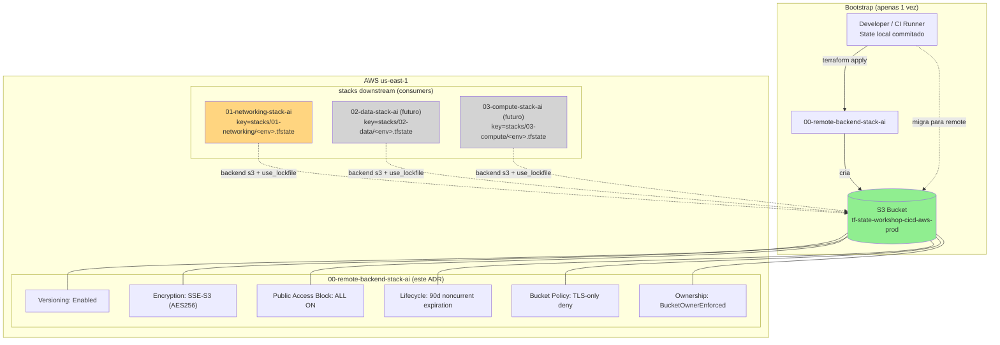

# ADR-0002: Remote Backend Terraform — S3 com Native Locking

## Status
Proposed

## Data
2026-05-23

## Contexto

O projeto atualmente nao possui um remote backend para o Terraform state. A stack `01-networking-stack-ai/` foi implementada (ver `IMPL-ADR-0001-2026-05-23.md`) com state local — o que e inaceitavel para qualquer ambiente compartilhado por mais de uma pessoa ou pipeline:

- Risco de perda total do state (arquivo nao versionado e nao replicado)
- Impossibilidade de colaboracao concorrente sem corromper o state
- Sem state locking — risco de `terraform apply` simultaneos causando recursos orfaos ou corrupcao do state
- Secrets potencialmente em plaintext no disco local
- Drift entre maquinas de desenvolvedores

Esta stack `00-remote-backend-stack-ai/` provisiona a infraestrutura de backend remoto que sera consumida pela `01-networking-stack-ai/` e por todas as stacks futuras (`02-*`, `03-*`, etc). E uma stack "raiz" — precisa existir **antes** das demais.

### Premissas herdadas do ADR-0001 e do CLAUDE.md

- **Regiao**: `us-east-1`
- **Provider**: `hashicorp/aws ~> 6.0` (resolvido para v6.46.0)
- **Terraform**: `>= 1.10.0` (ja declarado em `01-networking-stack-ai/versions.tf`)
- **Restricao**: apenas recursos nativos do provider `hashicorp/aws` — zero modulos comunitarios
- **Convencoes obrigatorias**: `.claude/rules/terraform-naming-conventions.md` (identificadores com `_`, valores humanos com `-`, `this` para singletons, arquivos `<recurso-pai>.<conceito-filho>.tf`, variaveis em `object({...})`, valores em `envs/*.tfvars`, outputs `{name}_{type}_{attribute}`)
- **Ambientes**: dev → staging → production com promocao manual

### Validacao MCP (Terraform Registry, 2026-05-23)

| Recurso | providerDocID | Status na v6.46.0 |
|---|---|---|
| `aws_s3_bucket` | 12311357 | Ativo. **Atributos inline `versioning`, `server_side_encryption_configuration`, `lifecycle_rule`, `policy`, `acl` estao DEPRECATED** — usar recursos dedicados. |
| `aws_s3_bucket_versioning` | 12311378 | Ativo. Bloco `versioning_configuration { status, mfa_delete }`. |
| `aws_s3_bucket_server_side_encryption_configuration` | 12311377 | Ativo. Suporta `AES256`, `aws:kms`, `aws:kms:dsse`, com `bucket_key_enabled` e `blocked_encryption_types`. |
| `aws_s3_bucket_public_access_block` | 12311374 | Ativo. 4 flags: `block_public_acls`, `block_public_policy`, `ignore_public_acls`, `restrict_public_buckets`. |
| `aws_s3_bucket_lifecycle_configuration` | 12311365 | Ativo. Usar `filter` (nao `prefix` — deprecated). Suporta `noncurrent_version_expiration` com `noncurrent_days` e `newer_noncurrent_versions`. |
| `aws_s3_bucket_policy` | 12311373 | Ativo. Limite 20KB de policy. |
| `aws_s3_bucket_ownership_controls` | 12311372 | Ativo. Recomendado `BucketOwnerEnforced` (desabilita ACLs). |
| `aws_dynamodb_table` | 12310622 | Ativo. **Nao sera utilizado** — ver decisao sobre locking. |

## Drivers da Decisao

- **Eliminar state local** — pre-requisito para qualquer ambiente compartilhado, CI/CD e operacoes day-2
- **State locking obrigatorio** — impedir `apply` concorrentes e corrupcao do state
- **Durabilidade do state** — versionamento para recovery point-in-time (drift, rollback de mudancas erradas)
- **Seguranca por design** — encryption at-rest, deny-public, TLS-only, IAM least privilege
- **Custo minimo** — backend e infraestrutura de suporte; nao deve ser um driver de custo significativo
- **Bootstrap simples** — desenvolvedores conseguem inicializar o backend sem dependencias circulares complexas
- **Suporte multi-ambiente** — dev/staging/production isolados, sem risco de cross-environment writes
- **Zero supply chain risk** — apenas recursos nativos `hashicorp/aws`, sem modulos comunitarios (heranca do ADR-0001)

## Opcoes Consideradas

### Opcao A: S3 + DynamoDB para state locking (padrao historico)

Bucket S3 para armazenar o state + tabela DynamoDB com particao key `LockID` para gerenciar locks. Padrao adotado pela comunidade desde 2018 e amplamente documentado.

**Recursos necessarios:**
- `aws_s3_bucket` + `aws_s3_bucket_versioning` + `aws_s3_bucket_server_side_encryption_configuration` + `aws_s3_bucket_public_access_block` + `aws_s3_bucket_ownership_controls` + `aws_s3_bucket_lifecycle_configuration` + `aws_s3_bucket_policy`
- `aws_dynamodb_table` (billing_mode `PAY_PER_REQUEST`, attribute `LockID` tipo `S`, hash_key `LockID`)

**Configuracao backend nas stacks downstream:**
```hcl
terraform {
  backend "s3" {
    bucket         = "tf-state-workshop-cicd-aws-prod"
    key            = "stacks/01-networking/terraform.tfstate"
    region         = "us-east-1"
    encrypt        = true
    dynamodb_table = "tf-state-lock-workshop-cicd-aws-prod"
  }
}
```

**Pros:**
- Padrao battle-tested ha mais de 7 anos — milhares de tutoriais, exemplos e troubleshooting
- Locking robusto via conditional writes do DynamoDB
- Visibilidade clara de locks ativos (consultando a tabela)
- Compatibilidade com versoes antigas do Terraform (< 1.10)
- Ferramentas third-party (Atlantis, Terragrunt, Spacelift) suportam de forma trivial

**Contras:**
- Recurso AWS adicional para manter (tabela DynamoDB)
- Custo extra (~$0.00-0.50/mes, negligenciavel mas existente)
- Mais um IAM permission set a configurar para usuarios e CI/CD
- Mais codigo Terraform para manter (~30-40 linhas a mais)
- Risco operacional: se a tabela DynamoDB for deletada acidentalmente, o locking quebra silenciosamente
- A partir do Terraform 1.11+, o argumento `dynamodb_table` no backend "s3" esta **deprecated** em favor de `use_lockfile` ([HashiCorp State Storage Notice](https://developer.hashicorp.com/terraform/language/backend/s3))

**Custo estimado mensal:** S3 (~$0.01) + DynamoDB on-demand (~$0.00-0.50) = **~$0.50/mes**

---

### Opcao B: S3 com Native Locking (`use_lockfile = true`) — Terraform 1.10+ GA

Apenas bucket S3, com locking gerenciado pelo proprio Terraform via lock-file dentro do bucket (`<key>.tflock`). Feature **GA desde Terraform 1.10 (novembro/2024)**. O bucket ja esta em uso obrigatorio (`>= 1.10.0`).

**Recursos necessarios:**
- `aws_s3_bucket` + `aws_s3_bucket_versioning` + `aws_s3_bucket_server_side_encryption_configuration` + `aws_s3_bucket_public_access_block` + `aws_s3_bucket_ownership_controls` + `aws_s3_bucket_lifecycle_configuration` + `aws_s3_bucket_policy`
- **Nenhum DynamoDB**

**Configuracao backend nas stacks downstream:**
```hcl
terraform {
  backend "s3" {
    bucket       = "tf-state-workshop-cicd-aws-prod"
    key          = "stacks/01-networking/terraform.tfstate"
    region       = "us-east-1"
    encrypt      = true
    use_lockfile = true
  }
}
```

**Pros:**
- Um recurso a menos para gerenciar (sem DynamoDB)
- Custo menor — apenas S3
- IAM mais simples (apenas permissoes S3, sem DynamoDB)
- Locking nativo do S3 via conditional writes (PutObject com `If-None-Match`) — mecanismo recomendado pela HashiCorp para novos projetos
- Alinhado com o roadmap oficial do Terraform: `dynamodb_table` esta marcado como deprecated
- Menos codigo Terraform (~30-40 linhas a menos)
- Sem risco de "tabela orfa" se o bucket for migrado/renomeado

**Contras:**
- Requer Terraform `>= 1.10.0` em **todas** as maquinas que tocam o state (ja e requisito no projeto)
- Menos tutoriais e exemplos na comunidade (feature relativamente nova — 18 meses no momento)
- Inspecao de locks ativos requer listar objetos `.tflock` no bucket (menos amigavel que `aws dynamodb scan`)
- Algumas ferramentas third-party podem ainda nao suportar (verificar Atlantis, Terragrunt — fora do escopo)

**Custo estimado mensal:** S3 apenas = **~$0.05/mes**

---

### Opcao C: Terraform Cloud / HCP Terraform (backend gerenciado)

Backend como SaaS gerenciado pela HashiCorp, com state storage, locking, RBAC, workspace separation, runs remotos e VCS integration.

**Pros:**
- Zero infra para manter
- RBAC granular, audit log, drift detection nativos
- UI para inspecao de state e runs
- Free tier para ate 5 usuarios

**Contras:**
- Dependencia externa fora da AWS (saida do guardrail "AWS-only")
- Tier pago para features de seguranca importantes (private modules, policy enforcement)
- Latencia adicional em runs (especialmente se rodar plan/apply no HCP)
- Vendor lock-in adicional
- Foge da proposta do workshop (CI/CD AWS-nativo)

**Custo estimado mensal:** $0 (free tier, ate 5 users) — porem features de seguranca em tier Standard+ ($20/user/mes)

---

### Opcao D: Consul para state storage

Backend nativo do HashiCorp para state e locking via Consul KV.

**Pros:**
- Locking nativo

**Contras:**
- Requer operacao de cluster Consul (servidores, raft, snapshots)
- Custo operacional desproporcional para o tamanho do projeto
- Nenhuma sinergia com a stack AWS deste workshop

**Descartada** sem analise detalhada — overkill operacional para o escopo.

## Decisao

**Opcao B: S3 com Native Locking (`use_lockfile = true`).**

Justificativa principal: o projeto **ja exige Terraform `>= 1.10.0`** (validado em `01-networking-stack-ai/versions.tf`), o que torna o `use_lockfile` totalmente compativel sem trade-offs. A HashiCorp esta deprecando o argumento `dynamodb_table` em favor do native locking, entao optar pela Opcao A hoje significaria refatorar amanha. A Opcao B reduz superficie operacional, custo e codigo Terraform.

### Justificativa pelos 6 pilares do Well-Architected Framework

| Pilar | Justificativa | Trade-off |
|---|---|---|
| **Operational Excellence** | Um unico recurso primario (bucket) para operar. Versioning permite point-in-time recovery do state. Lifecycle policy gerencia automaticamente versoes antigas. Lock-files visiveis via `aws s3 ls`. | Inspecao de locks menos intuitiva que listar uma tabela DynamoDB. |
| **Security** | TLS-only via bucket policy (`aws:SecureTransport`). SSE-S3 (AES256) at-rest por padrao. `BlockPublicAccess` em todas as 4 dimensoes. `BucketOwnerEnforced` desabilita ACLs (recomendacao AWS desde 2023). Bucket policy nega qualquer principal nao-permitido. State file contem credenciais sensiveis — toda essa camada e mandatoria. | SSE-KMS oferece audit log de uso da chave (CloudTrail KMS events) — abrimos mao em favor de simplicidade e custo. Pode ser upgrade futuro. |
| **Reliability** | S3 oferece 99.999999999% (11 nines) de durabilidade e 99.99% de SLA de disponibilidade em uma unica regiao. Versionamento habilitado protege contra corrupcao acidental ou maliciosa do state. Native locking via S3 conditional writes e atomico. | Single-region (us-east-1) — em caso de outage regional do S3, o state fica inacessivel. Cross-region replication descartada por custo/complexidade no escopo atual. |
| **Performance Efficiency** | State files sao pequenos (~50KB). Latencia de PUT/GET no S3 e adequada (~50-100ms). Sem necessidade de tuning. | Nenhum. |
| **Cost Optimization** | ~$0.05/mes total (storage + requests). Lifecycle policy expira versoes antigas apos 90 dias para evitar acumulo. Sem DynamoDB. Sem KMS keys (sem custo de $1/mes por key). | KMS key dedicada (~$1/mes) descartada — pode ser adicionada se compliance exigir. |
| **Sustainability** | Recursos minimos: 1 bucket, 0 compute. Lifecycle expira versoes antigas, reduzindo storage desnecessario ao longo do tempo. | Nenhum. |

## Consequencias

### Positivas
- Fundacao remota e segura para state de todas as stacks atuais e futuras
- Habilita colaboracao multi-usuario e pipelines CI/CD sem risco de corrupcao
- Versionamento permite recovery point-in-time em caso de erro humano (estado anterior recuperavel via S3 version)
- Bloqueio nativo elimina race conditions em `terraform apply`
- Codigo Terraform alinhado com o roadmap oficial do HashiCorp (sem deprecation futuro)
- Custo desprezivel (~$0.05/mes)
- IAM simples — apenas permissoes S3 para os principals que rodam Terraform

### Negativas / Trade-offs aceitos
- **Bootstrap chicken-and-egg**: o bucket precisa existir antes que stacks downstream possam referencia-lo. Resolvido com state local commitado deliberadamente (ver "Estrategia de inicializacao")
- Inspecao manual de locks requer `aws s3 ls`, menos amigavel que DynamoDB scan
- Single-region — sem DR cross-region para o state (aceitavel no escopo do workshop)
- Sem audit log de leituras do state em granularidade KMS (SSE-S3 nao oferece CloudTrail por leitura)

### Riscos e mitigacoes

| Risco | Probabilidade | Impacto | Mitigacao |
|---|---|---|---|
| Delecao acidental do bucket via console/Terraform | Baixa | Critico (state perdido para todas as stacks) | `lifecycle { prevent_destroy = true }` no `aws_s3_bucket`. `force_destroy = false`. Bucket policy nega `s3:DeleteBucket` para principals que nao sao o admin role |
| Lock-file orfao (`.tflock` deixado para tras por crash do Terraform) | Baixa | Medio | Documentar comando `terraform force-unlock <LOCK_ID>` no runbook RB-BACKEND-001. Lifecycle expira `.tflock` orfaos apos 7 dias |
| Versoes antigas inflam storage cost | Media | Baixo | Lifecycle policy expira `noncurrent_versions` apos 90 dias |
| Cross-stack name collision (mesmo `key` usado por duas stacks) | Media | Alto (state overwrite) | Padrao de naming estrito: `stacks/<NN-stack-name>/terraform.tfstate`. Code review obrigatorio em PRs que alteram `backend "s3"` |
| Outage regional do us-east-1 | Muito baixa | Alto (impossivel rodar Terraform) | Aceito. Workshop nao exige DR cross-region. Pode ser endereçado em ADR futuro com replicacao cross-region |
| Vazamento de credenciais via state | N/A | Alto | SSE-S3 at-rest + TLS-only + IAM least privilege. Stack downstream NUNCA deve armazenar secrets em variaveis Terraform — usar SSM Parameter Store ou Secrets Manager |
| Migracao incorreta do state local da stack-01 | Media | Alto | `terraform init -migrate-state -backend-config=...` documentado passo a passo. Backup do state local antes de migrar |

## Diagrama



## Implementation Guidelines (para o DevOps Engineer Agent)

### IaC Stack
- **Terraform** `>= 1.10.0` (ja em uso, mandatorio para `use_lockfile`)
- **Provider** `hashicorp/aws ~> 6.0` (resolvido v6.46.0, validado via Terraform MCP em 2026-05-23)
- **Restricao**: apenas recursos nativos `hashicorp/aws` — zero modulos comunitarios

### Diretorio da stack — nomes considerados

| Nome | Pros | Contras | Recomendacao |
|---|---|---|---|
| `00-remote-backend-stack-ai/` | Numerada com `00` para indicar "antes da 01". Padrao do projeto. | Pode confundir quem nao sabe que e bootstrap | **RECOMENDADO** |
| `bootstrap-remote-backend-ai/` | Nome semantico claro | Quebra padrao numerico do projeto | Nao recomendado |
| `00-backend-stack-ai/` | Mais curto | Menos especifico | Aceitavel |

**Decisao: `00-remote-backend-stack-ai/`** — preserva o padrao `NN-<nome>-stack-ai/` e o `00` deixa claro que precede a `01`.

### Recursos nativos do provider hashicorp/aws a serem utilizados

| Recurso Terraform | providerDocID | Finalidade |
|---|---|---|
| `aws_s3_bucket` | 12311357 | Bucket primario para state files |
| `aws_s3_bucket_versioning` | 12311378 | Habilitar versioning (`status = Enabled`) |
| `aws_s3_bucket_server_side_encryption_configuration` | 12311377 | SSE-S3 (`sse_algorithm = AES256`) |
| `aws_s3_bucket_public_access_block` | 12311374 | 4 flags = `true` |
| `aws_s3_bucket_ownership_controls` | 12311372 | `BucketOwnerEnforced` |
| `aws_s3_bucket_lifecycle_configuration` | 12311365 | Expirar versoes antigas (90d), abortar multipart uploads (7d), expirar `.tflock` orfaos (7d) |
| `aws_s3_bucket_policy` | 12311373 | Deny non-TLS, deny non-encrypted PUT |
| `aws_caller_identity` (data source) | - | Compor account_id no bucket name (evita colisao global) |
| `aws_region` (data source) | - | Compor region no bucket name |

### Estrutura de arquivos da stack `00-remote-backend-stack-ai/`

| Arquivo | Conteudo |
|---|---|
| `versions.tf` | Bloco `terraform { required_version = ">= 1.10.0", required_providers = { aws = "~> 6.0" } }`. **SEM bloco `backend "s3"` ate o pos-bootstrap** — ver "Estrategia de inicializacao" |
| `main.tf` | `provider "aws"` com `default_tags`, data sources `aws_caller_identity`, `aws_region` |
| `variables.tf` | Declaracao de `var.aws_region` (string) + `var.project` (object) + `var.backend` (object). **Sem `default`** |
| `outputs.tf` | Outputs com padrao `{name}_{type}_{attribute}` (ver secao Outputs abaixo) |
| `tags.tf` | `locals { common_tags = { Environment, Project, ManagedBy = "terraform", Stack = "remote-backend" } }` |
| `s3.tf` | `aws_s3_bucket.this` (com `lifecycle { prevent_destroy = true }` e `force_destroy = false`), `aws_s3_bucket_ownership_controls.this` |
| `s3.versioning.tf` | `aws_s3_bucket_versioning.this` (`status = Enabled`) |
| `s3.encryption.tf` | `aws_s3_bucket_server_side_encryption_configuration.this` (AES256, `bucket_key_enabled = true`) |
| `s3.public-access-block.tf` | `aws_s3_bucket_public_access_block.this` (4 flags true) |
| `s3.lifecycle.tf` | `aws_s3_bucket_lifecycle_configuration.this` com 3 regras: noncurrent versions, multipart aborts, `.tflock` cleanup |
| `s3.policy.tf` | `aws_s3_bucket_policy.this` + `data "aws_iam_policy_document" "bucket"` (deny non-TLS, deny unencrypted PUT) |
| `envs/dev.tfvars` | Valores para dev |
| `envs/staging.tfvars` | Valores para staging |
| `envs/production.tfvars` | Valores para prod |

### Shape das variaveis (variables.tf — sem defaults)

```hcl
variable "aws_region" {
  description = "AWS region where the state backend bucket will be provisioned."
  type        = string
  nullable    = false
}

variable "project" {
  description = "Configuracoes do projeto."
  type = object({
    name        = string  # ex: "workshop-cicd-aws"
    environment = string  # "dev" | "staging" | "production"
  })
  nullable = false
}

variable "backend" {
  description = "Configuracoes do bucket de remote backend."
  type = object({
    bucket_name_prefix             = string  # ex: "tf-state-workshop-cicd-aws"
    noncurrent_version_expiration_days = number  # recomendado: 90
    abort_incomplete_multipart_days    = number  # recomendado: 7
    lock_file_expiration_days          = number  # recomendado: 7 (cleanup de .tflock orfaos)
    force_destroy                      = bool    # SEMPRE false em prod; true apenas em dev/sandbox descartavel
  })
  nullable = false
}
```

**Naming do bucket (definido em `s3.tf`):**
```hcl
locals {
  bucket_name = "${var.backend.bucket_name_prefix}-${data.aws_caller_identity.current.account_id}-${var.project.environment}"
  # exemplo final: tf-state-workshop-cicd-aws-123456789012-production
}
```
Justificativa: nomes de bucket S3 sao globais. Compor com `account_id` garante unicidade sem precisar adivinhar sufixos. Compor com `environment` da o isolamento de buckets por ambiente.

### Outputs (padrao `{name}_{type}_{attribute}`)

```hcl
output "state_bucket_id" {
  description = "Name of the S3 bucket storing Terraform state."
  value       = aws_s3_bucket.this.id
}

output "state_bucket_arn" {
  description = "ARN of the S3 bucket storing Terraform state."
  value       = aws_s3_bucket.this.arn
}

output "state_bucket_region" {
  description = "Region where the state bucket resides."
  value       = aws_s3_bucket.this.region
}

output "backend_config_snippet" {
  description = "Ready-to-copy backend configuration block for downstream stacks."
  value       = <<-EOT
    terraform {
      backend "s3" {
        bucket       = "${aws_s3_bucket.this.id}"
        key          = "stacks/<STACK_NAME>/terraform.tfstate"
        region       = "${aws_s3_bucket.this.region}"
        encrypt      = true
        use_lockfile = true
      }
    }
  EOT
}
```

### Ordem de execucao e dependencias

```
1. versions.tf, variables.tf, tags.tf, main.tf   -> sem dependencias internas
2. s3.tf                                          -> cria aws_s3_bucket.this (+ ownership_controls)
3. s3.versioning.tf                               -> depende de s3.tf
4. s3.encryption.tf                               -> depende de s3.tf
5. s3.public-access-block.tf                      -> depende de s3.tf
6. s3.lifecycle.tf                                -> depende de s3.versioning.tf (lifecycle requer versioning)
7. s3.policy.tf                                   -> depende de s3.tf e s3.public-access-block.tf (block_public_policy precisa estar set antes da policy)
8. outputs.tf                                     -> depende de todos
```

O Terraform resolve via referencias automaticamente. A ordem acima e conceitual.

### Variaveis e secrets necessarios
- Nenhum secret. AWS credentials sao fornecidas via `aws configure` ou variaveis de ambiente do runner CI/CD
- Todos os valores em `envs/<env>.tfvars`

### Validacoes pos-deploy
1. `terraform plan` retorna 0 changes (state consistente)
2. `aws s3api get-bucket-versioning --bucket <bucket>` retorna `Status: Enabled`
3. `aws s3api get-bucket-encryption --bucket <bucket>` retorna `AES256` na regra
4. `aws s3api get-public-access-block --bucket <bucket>` retorna as 4 flags `true`
5. `aws s3api get-bucket-policy --bucket <bucket>` retorna o JSON com `aws:SecureTransport: false` no `Condition`
6. `aws s3api get-bucket-lifecycle-configuration --bucket <bucket>` retorna 3 regras (noncurrent, multipart, tflock)
7. `aws s3api get-bucket-ownership-controls --bucket <bucket>` retorna `BucketOwnerEnforced`
8. Teste funcional: criar arquivo de teste com `aws s3 cp` usando `--no-sigv4` deve **falhar** (TLS enforcement)

### Rollback strategy
- **Durante bootstrap (pre-migracao de outras stacks)**: `terraform destroy` remove o bucket sem impacto. Garantir `force_destroy = true` apenas em dev/sandbox; em prod, alterar para `true` manualmente antes do destroy.
- **Apos migracao das stacks downstream**: NAO destruir. O bucket conserva state de N stacks. Para descomissionar, primeiro migrar cada stack de volta para state local (`terraform init -migrate-state` reverso), depois destruir.
- Se um lock-file ficar orfao por crash: `terraform force-unlock <LOCK_ID>` na stack afetada (LOCK_ID aparece na mensagem de erro do Terraform).

## Estrategia de inicializacao (bootstrap)

O bucket que armazena o state nao pode armazenar seu **proprio** state no primeiro `apply` — chicken-and-egg classico. Abordagem recomendada:

### Fase 1 — Primeiro apply com state local

1. Na stack `00-remote-backend-stack-ai/`, **NAO** declarar bloco `backend "s3"` em `versions.tf`. State sera local por padrao.
2. Rodar:
   ```bash
   cd 00-remote-backend-stack-ai
   terraform init
   terraform plan  -var-file="envs/production.tfvars"
   terraform apply -var-file="envs/production.tfvars"
   ```
3. Bucket criado. `terraform.tfstate` esta em disco local.

### Fase 2 — Migrar o state da propria stack-00 para o bucket

1. Adicionar bloco `backend "s3"` em `00-remote-backend-stack-ai/versions.tf` apontando para o proprio bucket:
   ```hcl
   terraform {
     required_version = ">= 1.10.0"
     required_providers {
       aws = { source = "hashicorp/aws", version = "~> 6.0" }
     }
     backend "s3" {
       bucket       = "tf-state-workshop-cicd-aws-<ACCOUNT_ID>-production"
       key          = "stacks/00-remote-backend/terraform.tfstate"
       region       = "us-east-1"
       encrypt      = true
       use_lockfile = true
     }
   }
   ```
2. Migrar:
   ```bash
   terraform init -migrate-state
   # Responder "yes" quando o Terraform perguntar se quer mover o state local para o S3
   ```
3. Apos confirmacao bem-sucedida, **DELETAR** os arquivos locais: `terraform.tfstate` e `terraform.tfstate.backup`.

### Fase 3 — Migrar a stack-01 (e quaisquer outras) para o backend remoto

1. Em `01-networking-stack-ai/versions.tf`, adicionar o backend (com `key` proprio):
   ```hcl
   terraform {
     required_version = ">= 1.10.0"
     required_providers {
       aws = { source = "hashicorp/aws", version = "~> 6.0" }
     }
     backend "s3" {
       bucket       = "tf-state-workshop-cicd-aws-<ACCOUNT_ID>-production"
       key          = "stacks/01-networking/terraform.tfstate"
       region       = "us-east-1"
       encrypt      = true
       use_lockfile = true
     }
   }
   ```
2. Migrar:
   ```bash
   cd 01-networking-stack-ai
   cp terraform.tfstate terraform.tfstate.bootstrap-backup  # backup defensivo
   terraform init -migrate-state
   # Confirmar com "yes"
   ```
3. Validar:
   ```bash
   terraform plan -var-file="envs/production.tfvars"
   # Esperado: 0 changes
   ```
4. Apos validacao, deletar `terraform.tfstate*` locais e remover o `terraform.tfstate.bootstrap-backup` apenas apos um ciclo completo de apply/plan bem-sucedido remoto.

### Comando exato de migracao da stack-01 (resumo executavel)

```bash
cd 01-networking-stack-ai
terraform init \
  -migrate-state \
  -backend-config="bucket=tf-state-workshop-cicd-aws-<ACCOUNT_ID>-production" \
  -backend-config="key=stacks/01-networking/terraform.tfstate" \
  -backend-config="region=us-east-1" \
  -backend-config="encrypt=true" \
  -backend-config="use_lockfile=true"
```

## Configuracao do bloco `backend "s3"` (template para todas as stacks downstream)

```hcl
terraform {
  required_version = ">= 1.10.0"

  required_providers {
    aws = {
      source  = "hashicorp/aws"
      version = "~> 6.0"
    }
  }

  backend "s3" {
    bucket       = "tf-state-workshop-cicd-aws-<ACCOUNT_ID>-<ENV>"
    key          = "stacks/<NN-stack-name>/terraform.tfstate"
    region       = "us-east-1"
    encrypt      = true
    use_lockfile = true
  }
}
```

### Padrao de naming do `key` (mandatorio)
```
stacks/<numero-stack-name>/terraform.tfstate
```
- `01-networking-stack-ai` → `stacks/01-networking/terraform.tfstate`
- `02-data-stack-ai` → `stacks/02-data/terraform.tfstate`
- `00-remote-backend-stack-ai` → `stacks/00-remote-backend/terraform.tfstate`

Eliminar o sufixo `-stack-ai` no `key` evita verbosidade desnecessaria no S3.

## Multi-ambiente — estrategia recomendada

Avaliacao das tres abordagens classicas:

| Abordagem | Pros | Contras | Recomendacao |
|---|---|---|---|
| **Buckets separados por ambiente** (`tf-state-...-dev`, `tf-state-...-staging`, `tf-state-...-production`) | Isolamento total de blast radius. IAM granular por bucket. Permite politicas de retencao diferentes por ambiente (ex.: prod com 365d, dev com 30d). Acidente em dev nao corrompe prod. | Mais buckets para criar/manter. | **RECOMENDADO** |
| **Workspaces Terraform** (1 bucket, `terraform workspace new dev`) | Menos infra | Workspaces sao tratados como segundo cliente pelo proprio HashiCorp ("not for strong isolation"). Mesma IAM policy para todos os ambientes. Risco de `terraform workspace select prod` errado | Nao recomendado para separacao dev/staging/prod |
| **Mesmo bucket, prefixo de key** (`key = "env/dev/stacks/.../tfstate"`) | Menos infra que buckets separados | IAM nao consegue facilmente isolar leitura prod vs dev no mesmo bucket (precisa de policy com condition por prefixo, complexo). Lifecycle policies sao por bucket, nao por prefixo | Nao recomendado |

**Decisao: buckets separados por ambiente.** A stack `00-remote-backend-stack-ai/` e aplicada 3 vezes (uma por ambiente) usando `envs/{dev,staging,production}.tfvars`, criando 3 buckets distintos. O isolamento de IAM e blast radius justifica o custo adicional (~$0.15/mes total).

## Custo Estimado

### Premissas
- ~10 stacks no horizonte (`00` ate `09`)
- State files ~50KB cada
- ~20 commits/PRs por semana atualizam algum state → ~100 PUT/GET por dia
- Versionamento gera ~30 versoes/stack/mes
- 3 ambientes (dev, staging, prod) → 3 buckets identicos

### Calculo (por bucket — regiao us-east-1)

| Item | Quantidade | Custo unitario | Mensal |
|---|---|---|---|
| Storage S3 Standard | 10 stacks × 30 versoes × 50KB = ~15MB | $0.023/GB | < $0.01 |
| PUT/COPY/POST requests | ~3.000/mes | $0.005/1.000 | $0.02 |
| GET requests | ~10.000/mes | $0.0004/1.000 | $0.01 |
| Lifecycle transitions | desprezivel | - | $0.00 |
| **Total por bucket** | | | **~$0.05/mes** |

### Total mensal do remote backend (3 ambientes)

| Ambiente | Custo |
|---|---|
| `dev` | ~$0.05/mes |
| `staging` | ~$0.05/mes |
| `production` | ~$0.05/mes |
| **Total** | **~$0.15/mes** |

Custo absolutamente negligenciavel. Para referencia, e ~700x mais barato que os NAT Gateways da stack-01 (~$109.50/mes).

### Comparativo com Opcao A (S3 + DynamoDB)
- Opcao A: ~$0.50/mes por ambiente (DynamoDB on-demand com ~100 reads/writes mensais)
- Opcao B (escolhida): ~$0.05/mes por ambiente

Diferenca de ~$0.45/mes/ambiente — irrelevante isoladamente, porem confirma o alinhamento custo+simplicidade.

### Oportunidades de otimizacao futura
- Habilitar S3 Intelligent-Tiering se state crescer absurdamente (improvavel para state files)
- Cross-region replication apenas se compliance/DR exigir
- Migrar SSE-S3 → SSE-KMS se compliance exigir audit log de leituras (custo extra: ~$1/mes/key)

## Observabilidade e Day-2

### Metricas-chave (CloudWatch)
- `BucketSizeBytes` — crescimento anomalo do storage
- `NumberOfObjects` — contagem total de versoes (sanity check do lifecycle)
- `4xxErrors` no S3 — pode indicar permissoes IAM quebradas em CI/CD
- `5xxErrors` no S3 — outage regional

### Alarmes recomendados
| Alarme | Metrica | Threshold | Acao |
|---|---|---|---|
| State bucket sem versionamento | AWS Config rule `s3-bucket-versioning-enabled` | Compliance status NON_COMPLIANT | SNS notification para equipe |
| State bucket com acesso publico | AWS Config rule `s3-bucket-public-read-prohibited` | NON_COMPLIANT | Pagina de alta prioridade |
| State bucket crescimento anomalo | `BucketSizeBytes > 100MB` | 100MB (state files normais sao << 1MB) | Investigar — pode indicar versoes nao expirando ou state file corrompido/inflado |
| 4xx errors elevados | `4xxErrors > 50` em 5min | 50 erros | Investigar — pode indicar credenciais expiradas ou permissoes IAM quebradas |

### Dashboards
- Painel CloudWatch com BucketSizeBytes e NumberOfObjects por bucket
- Inventario manual via `aws s3api list-objects-v2 --bucket <bucket> --prefix stacks/` para auditar quais stacks estao usando o backend

### Runbooks necessarios
- **RB-BACKEND-001**: Limpeza de lock-file orfao apos crash do Terraform — `terraform force-unlock <LOCK_ID>`
- **RB-BACKEND-002**: Recovery do state via versionamento — `aws s3api list-object-versions --bucket <bucket> --prefix stacks/<stack>/terraform.tfstate` + `aws s3api copy-object` para restaurar versao anterior
- **RB-BACKEND-003**: Migracao de stack para o backend remoto (Fase 3 do bootstrap)
- **RB-BACKEND-004**: Promocao entre ambientes — copiar valores de tfvars de dev → staging → production, **NUNCA** copiar state entre ambientes

### Backup e DR
- Versionamento do S3 funciona como backup nativo com 90 dias de janela (definido pela lifecycle policy)
- Para DR cross-region: nao implementado neste ADR. Se necessario, adicionar `aws_s3_bucket_replication_configuration` (providerDocID 12311375) em ADR futuro
- Em ultimo caso: cada CI runner ou desenvolvedor mantem `terraform state pull > backup-<timestamp>.tfstate` antes de operacoes de alto risco

## Seguranca

### IAM (principio do least privilege)

**Policy minima para um principal que roda Terraform contra este backend:**
```json
{
  "Version": "2012-10-17",
  "Statement": [
    {
      "Sid": "ListBucketForBackend",
      "Effect": "Allow",
      "Action": ["s3:ListBucket"],
      "Resource": "arn:aws:s3:::tf-state-workshop-cicd-aws-<ACCOUNT_ID>-<ENV>"
    },
    {
      "Sid": "ReadWriteStateAndLockFiles",
      "Effect": "Allow",
      "Action": ["s3:GetObject", "s3:PutObject", "s3:DeleteObject"],
      "Resource": "arn:aws:s3:::tf-state-workshop-cicd-aws-<ACCOUNT_ID>-<ENV>/stacks/*"
    }
  ]
}
```
Notas:
- **Sem permissao** de `s3:DeleteBucket`, `s3:PutBucketPolicy`, `s3:PutBucketVersioning`, `s3:PutEncryptionConfiguration` — somente o admin role pode alterar configuracao do bucket
- **Sem necessidade** de permissoes DynamoDB (vs. Opcao A)
- O `s3:DeleteObject` e necessario porque o Terraform deleta `.tflock` ao liberar o lock — sem essa permissao, o lock fica preso

### Criptografia
- **At-rest**: SSE-S3 (AES256). Bucket key habilitada (`bucket_key_enabled = true`) — sem custo extra mas reduz overhead de encryption
- **In-transit**: TLS obrigatorio via bucket policy (`Condition: { Bool: { "aws:SecureTransport": "false" } }` no Deny)
- **Upgrade futuro**: migrar para SSE-KMS com CMK dedicada se compliance exigir audit log de leituras (CloudTrail KMS events)

### Network segmentation
- Bucket S3 e regional, sem VPC attachment necessario
- Acesso via internet com TLS — protegido pelo IAM e bucket policy
- **Upgrade futuro**: VPC Endpoint Gateway para S3 (`aws_vpc_endpoint`) se workloads dentro da VPC da stack-01 precisarem acessar o state — gratuito e elimina trafego pela internet publica

### Bucket policy (deny statements obrigatorios)

```hcl
data "aws_iam_policy_document" "bucket" {
  # Deny any non-TLS access
  statement {
    sid     = "DenyNonTLSRequests"
    effect  = "Deny"
    actions = ["s3:*"]
    principals {
      type        = "*"
      identifiers = ["*"]
    }
    resources = [
      aws_s3_bucket.this.arn,
      "${aws_s3_bucket.this.arn}/*"
    ]
    condition {
      test     = "Bool"
      variable = "aws:SecureTransport"
      values   = ["false"]
    }
  }

  # Deny unencrypted object uploads (defense in depth — SSE-S3 ja e default, mas isso bloqueia uploads que explicitamente desativem)
  statement {
    sid     = "DenyUnencryptedObjectUploads"
    effect  = "Deny"
    actions = ["s3:PutObject"]
    principals {
      type        = "*"
      identifiers = ["*"]
    }
    resources = ["${aws_s3_bucket.this.arn}/*"]
    condition {
      test     = "StringNotEquals"
      variable = "s3:x-amz-server-side-encryption"
      values   = ["AES256"]
    }
  }
}
```

### Logging e auditoria
- **CloudTrail**: deve estar habilitado na conta para auditar `s3:PutObject`, `s3:DeleteObject` no bucket de state (fora do escopo desta stack)
- **S3 Access Logging**: nao habilitado por padrao — opcional. Para projetos com compliance estrito, habilitar com bucket separado de logs
- **AWS Config**: regras recomendadas (a serem habilitadas em ADR de governanca futuro):
  - `s3-bucket-versioning-enabled`
  - `s3-bucket-public-read-prohibited` / `s3-bucket-public-write-prohibited`
  - `s3-bucket-server-side-encryption-enabled`
  - `s3-bucket-ssl-requests-only`

### Avaliacao de MFA delete
- **Decisao: NAO habilitar nesta fase**
- **Pros**: protecao adicional contra delecao de versoes
- **Contras**: exige root account credentials para todas as operacoes de versionamento (incluindo desabilitar) — impraticavel para CI/CD. Habilitar apenas via AWS CLI com `--mfa` no root account
- **Mitigacao alternativa**: `lifecycle { prevent_destroy = true }` no recurso + bucket policy negando `s3:DeleteBucket` para non-admin
- **Reavaliar**: se requisitos de compliance (PCI-DSS, HIPAA) forem declarados no futuro

## Referencias

- AWS Well-Architected Framework — Security Pillar: [https://docs.aws.amazon.com/wellarchitected/latest/security-pillar/welcome.html](https://docs.aws.amazon.com/wellarchitected/latest/security-pillar/welcome.html)
- Terraform Backend `s3` (oficial, inclui `use_lockfile`): [https://developer.hashicorp.com/terraform/language/backend/s3](https://developer.hashicorp.com/terraform/language/backend/s3)
- Terraform 1.10 release notes (S3 native locking GA): [https://github.com/hashicorp/terraform/releases/tag/v1.10.0](https://github.com/hashicorp/terraform/releases/tag/v1.10.0)
- Terraform AWS Provider v6.46.0 — aws_s3_bucket: [https://registry.terraform.io/providers/hashicorp/aws/6.46.0/docs/resources/s3_bucket](https://registry.terraform.io/providers/hashicorp/aws/6.46.0/docs/resources/s3_bucket)
- Terraform AWS Provider v6.46.0 — aws_s3_bucket_versioning: [https://registry.terraform.io/providers/hashicorp/aws/6.46.0/docs/resources/s3_bucket_versioning](https://registry.terraform.io/providers/hashicorp/aws/6.46.0/docs/resources/s3_bucket_versioning)
- Terraform AWS Provider v6.46.0 — aws_s3_bucket_server_side_encryption_configuration: [https://registry.terraform.io/providers/hashicorp/aws/6.46.0/docs/resources/s3_bucket_server_side_encryption_configuration](https://registry.terraform.io/providers/hashicorp/aws/6.46.0/docs/resources/s3_bucket_server_side_encryption_configuration)
- Terraform AWS Provider v6.46.0 — aws_s3_bucket_lifecycle_configuration: [https://registry.terraform.io/providers/hashicorp/aws/6.46.0/docs/resources/s3_bucket_lifecycle_configuration](https://registry.terraform.io/providers/hashicorp/aws/6.46.0/docs/resources/s3_bucket_lifecycle_configuration)
- Terraform AWS Provider v6.46.0 — aws_s3_bucket_public_access_block: [https://registry.terraform.io/providers/hashicorp/aws/6.46.0/docs/resources/s3_bucket_public_access_block](https://registry.terraform.io/providers/hashicorp/aws/6.46.0/docs/resources/s3_bucket_public_access_block)
- AWS S3 Block Public Access: [https://docs.aws.amazon.com/AmazonS3/latest/userguide/access-control-block-public-access.html](https://docs.aws.amazon.com/AmazonS3/latest/userguide/access-control-block-public-access.html)
- AWS S3 Bucket Ownership Controls (BucketOwnerEnforced): [https://docs.aws.amazon.com/AmazonS3/latest/userguide/about-object-ownership.html](https://docs.aws.amazon.com/AmazonS3/latest/userguide/about-object-ownership.html)
- AWS S3 Pricing: [https://aws.amazon.com/s3/pricing/](https://aws.amazon.com/s3/pricing/)
- ADRs relacionados:
  - `docs/ADR-0001-networking-stack-vpc-multi-az.md` — define o padrao "apenas recursos nativos AWS" e o Terraform `>= 1.10.0` herdados aqui
