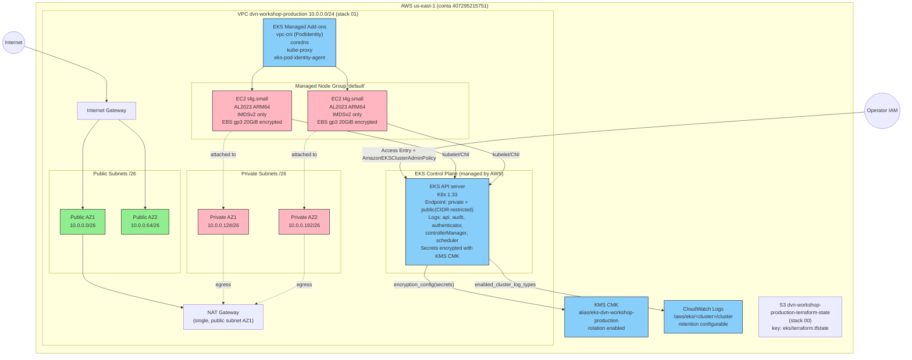

# ADR-0003: EKS Cluster — Managed Node Group ARM (t4g.small) com Pod Identity, Access Entries e Control Plane Logging

## Status

Accepted (supersede a versao anterior do ADR-0003, escrita em 2026-05-23)

## Data

2026-05-24

## Contexto

Apos a fundacao de rede entregue pela stack 01 (VPC `dvn-workshop-production` com CIDR `10.0.0.0/24`, 2 AZs, 2 subnets publicas `/26`, 2 subnets privadas `/26`, 1 NAT Gateway compartilhado e Flow Logs condicionais) e o backend remoto S3 entregue pela stack 00 (bucket `dvn-workshop-production-terraform-state`), o projeto `dvn-workshop` precisa de um cluster Kubernetes gerenciado para hospedar as workloads de aplicacao do ambiente `production`. Este ADR especifica a arquitetura da stack `02-eks-stack-ai`.

Ambas as stacks pre-requisitas (00 e 01) **ainda nao foram deployadas**. Este ADR assume que o engineer fara o deploy de 00 e 01 antes de aplicar a stack 02; o `terraform_remote_state` da stack 01 deve estar populado e o bucket da stack 00 deve existir no momento do `terraform apply` da stack 02.

### Constraints reais do ambiente AWS (descobertos empiricamente — incorporados a esta decisao)

1. **A conta AWS `407295215751` bloqueia EC2 fora do free-tier**. Tentativas anteriores de `t3.medium` ON_DEMAND falharam no ASG com `InvalidParameterCombination - The specified instance type is not eligible for Free Tier`. Tipos elegiveis: `t2.micro` (1 vCPU/1 GB), `t3.micro` (2 vCPU/1 GB), `t4g.small` (ARM, 2 vCPU/2 GB — promo free-tier). Para um EKS minimamente viavel (system pods do CoreDNS, kube-proxy, vpc-cni, pod-identity-agent ja consomem ~500–700 MiB de RAM), `t3.micro`/`t2.micro` ficam saturados antes mesmo de receber workloads. `t4g.small` e a unica opcao viavel.
2. **Kubernetes 1.31 esta em extended support em 2026-05** (release Aug/2024, EOSS 2025-11-25). Versoes em standard support neste momento, confirmadas pela documentacao AWS oficial: `1.33` (EOSS 2026-07-28), `1.34` (EOSS 2026-12-02), `1.35` (EOSS 2027-03-27 — default em criacoes novas). Standard support custa `$0.10/hr` por cluster; extended support custa `$0.60/hr` por cluster (6x mais).
3. **`bootstrap_cluster_creator_admin_permissions` e create-only attribute**. Qualquer alteracao pos-criacao forca o Terraform a destruir e recriar o cluster inteiro. O ADR exige que o engineer trate este atributo com `lifecycle { ignore_changes = [access_config[0].bootstrap_cluster_creator_admin_permissions] }` desde a primeira versao da stack.
4. **Em-dash (`—`) e caracteres nao-ASCII em descriptions de recursos AWS expostas a API (especialmente `aws_security_group.description`, `aws_iam_role.description`, `aws_kms_key.description`) causam falha de validacao na API.** Use apenas ASCII (`a-z A-Z 0-9 espaco . , - _ : ( )`) em todas as descriptions; o Markdown deste ADR pode usar pontuacao livre.

### Premissas (alinhadas com os ADR-0001 e ADR-0002)

- **Regiao**: `us-east-1`
- **Ambiente**: unico, `production` (convencao do skill `terraform-deploy` deste repo)
- **IaC**: Terraform `>= 1.10.0`, provider `hashicorp/aws ~> 6.0` resolvido para `6.46.0` (validado via Terraform MCP em 2026-05-24)
- **Restricao herdada do ADR-0001**: apenas recursos nativos do provider `hashicorp/aws` — sem modulos comunitarios
- **SLA alvo do cluster**: control plane com SLA AWS de 99.95%; data plane com 2 nodes em 2 AZs (RTO ~5 min para reposicao automatica de node, RPO = N/A para camadas stateless)

## Drivers da Decisao

- **Free-tier compulsorio**: a SCP da conta bloqueia outros tipos de instancia (constraint 1).
- **Standard support obrigatorio**: evitar penalidade de 6x no preco do control plane (constraint 2).
- **Producao em conta de aprendizado**: bom equilibrio entre rigor (logging, encryption, IMDSv2) e custo (1 NAT, 1 NodeGroup, control plane standard).
- **Stack downstream compativel com IAM moderna**: usar Pod Identity (lancado em 2023, GA em 2024) em vez de IRSA quando possivel, simplificando associacao IAM por pod.
- **Estado atual da stack 01**: 2 AZs e subnets `/26` (62 IPs uteis) limitam o numero maximo de pods/node sem prefix delegation no vpc-cni.
- **Plano de stacks downstream**: ALB Controller, ExternalDNS, observability (ADOT/Prometheus), workloads de aplicacao — todas dependem dos outputs desta stack.

## Opcoes Consideradas

### Opcao A: EKS com Managed Node Group `t4g.small` ARM (RECOMENDADA)

Cluster EKS standard (Kubernetes 1.33) com um unico Managed Node Group (`default`) composto por 2 instancias `t4g.small` ON_DEMAND (AMI `AL2023_ARM_64_STANDARD`), distribuidas nas 2 subnets privadas da stack 01. Launch template customizado garante IMDSv2 obrigatorio e EBS gp3 criptografado. 4 add-ons gerenciados (`vpc-cni`, `coredns`, `kube-proxy`, `eks-pod-identity-agent`). Authentication mode `API` puro com Access Entries para administradores humanos. Encryption at rest dos secrets do Kubernetes via KMS CMK dedicada. Control plane com os 5 log types habilitados, persistidos em CloudWatch log group dedicado.

**Pros**
- Unica opcao compativel com a SCP de free-tier que prove RAM suficiente para system pods + 1–2 workloads de teste por node.
- ARM/Graviton: ~20% mais barato e mais eficiente em performance/watt que x86 equivalente.
- 2 nodes em 2 AZs satisfazem o requisito explicito de redundancia (constraint do projeto).
- Managed Node Group: lifecycle (rolling updates, drain, AMI updates) e operado pela AWS.
- Pod Identity: associacao IAM por SA sem precisar manter OIDC provider/IRSA trust policies.
- Access Entries com `authentication_mode = "API"` elimina o `aws-auth` ConfigMap legado.
- Logging e encryption habilitados desde o dia zero.

**Contras**
- Imagens de container precisam ser multi-arch ou explicitamente ARM (`linux/arm64`). Algumas imagens publicas legadas nao tem variante ARM.
- 2 GB de RAM/node e justo: depois de system pods, sobram ~1 GB para workloads. Aceitavel em ambiente de workshop, restritivo em producao real.
- 2 AZs (limite do CIDR `/24` atual) significa que perda de uma AZ deixa o cluster com 1 node — degradacao significativa.
- Subnets privadas `/26` (62 IPs) limitam a densidade de pods/node sem prefix delegation. `t4g.small` suporta ate 11 pods/node sem prefix delegation (3 ENIs x 4 IPs por ENI - 1).

**Custo estimado mensal (us-east-1)**
- Control plane EKS (standard support): `$0.10/hr * 730 = $73.00`
- 2x t4g.small ON_DEMAND: `$0.0168/hr * 2 * 730 = $24.53`
- 2x EBS gp3 20 GiB: `$0.08/GB-mo * 20 * 2 = $3.20`
- CloudWatch Logs ingestion para 5 control plane log types: `$0.50/GB` (estimativa de 2–5 GB/mes para cluster pequeno = `$1–3`)
- CloudWatch Logs storage: `$0.03/GB-mo` (5 GB com retencao 30d = `~$0.15`)
- KMS CMK (1 chave): `$1.00/mo`
- Container Insights (se habilitado): adicional CloudWatch metrics + logs (`~$5–10/mo` para 2 nodes)
- **Total fixo (sem container insights, sem data egress): ~$103/mes**

---

### Opcao B: EKS Auto Mode

EKS Auto Mode (`compute_config.enabled = true`) delega a AWS o gerenciamento do node pool: a AWS provisiona instancias automaticamente, aplica seguranca, faz patch, drain e replace. Workloads schedulam normalmente; nao ha node group para gerenciar.

**Pros**
- Operacao day-2 quase zero: AWS atualiza nodes, AMIs, kernel automaticamente.
- Bin-packing automatizado.
- IAM e logging configurados pelo modo.

**Contras (decisivos)**
- **Auto Mode escolhe o tipo de instancia automaticamente.** Nao ha garantia de que ficara em free-tier; a SCP da conta provavelmente vai bloquear a criacao do node, deixando o cluster sem capacidade. Constraint 1 inviabiliza esta opcao.
- O requisito explicito do projeto e ter 2 nodes deterministicos para fins didaticos (mostrar `kubectl get nodes` retornando 2 entradas, ASG, launch template, etc.). Auto Mode esconde esses primitivos.
- Custo adicional do Auto Mode (`12%` premium por vCPU/hora alem das EC2) reduz a vantagem operacional num cluster pequeno.

**Custo estimado mensal**
- Control plane: `$73.00`
- Auto Mode premium + nodes gerenciados: depende do que a AWS provisionar — provavelmente bloqueado pela SCP. Indeterminado.

---

### Opcao C: EKS com Fargate (sem nodes)

EKS com Fargate profiles — pods schedulam diretamente em micro-VMs gerenciadas pela AWS. Sem `aws_eks_node_group`, sem EC2, sem launch template.

**Pros**
- Bypass da SCP de free-tier: Fargate nao usa EC2 nominalmente do customer.
- Sem operacao de OS.
- Isolamento por pod (cada pod roda em sua propria micro-VM).

**Contras (decisivos)**
- **Nao atende ao requisito explicito de "2 nodes EC2"**. Fargate nao expoe nodes; `kubectl get nodes` retorna nodes virtuais que sao um por pod.
- Limitacoes severas: sem DaemonSets, sem hostNetwork/hostPort, sem privileged, sem persistent volumes EBS (apenas EFS/FSx), sem GPU, sem custom AMI, vCPU/RAM em SKUs fixas, cold start de 30–60s.
- Custo por vCPU/hora bem superior a EC2 free-tier: ~$0.04/vCPU-hr + $0.0044/GB-hr (~$30–60/mes para 2 pods continuos com 0.5 vCPU/1 GB).
- Add-ons que esperam DaemonSet (vpc-cni, kube-proxy nos nodes) operam diferente — vpc-cni e substituido por AWSVPC trunking interno do Fargate.

**Custo estimado mensal**
- Control plane: `$73.00`
- Fargate (2 pods 0.5 vCPU/1 GB continuos): `~$45/mes`
- **Total: ~$118/mes** + complexidade de migrar workloads que dependem de primitivos de node.

## Decisao

**Opcao A — EKS standard com Managed Node Group ARM (t4g.small)**.

Justificativa contra os pilares do Well-Architected:

| Pilar | Justificativa | Trade-off aceito |
|---|---|---|
| **Operational Excellence** | MNG opera lifecycle de nodes (drain, replace, AMI updates). Add-ons gerenciados removem complexidade operacional de CoreDNS/vpc-cni/kube-proxy. Pod Identity simplifica IAM por SA. Outputs explicitos para stacks downstream. Skill `terraform-deploy` aplica via `envs/production.tfvars`. | Operador precisa aprovar upgrades de versao manualmente para evitar quebras de imagem ARM. |
| **Security** | `authentication_mode = "API"` (sem `aws-auth` ConfigMap); Access Entries auditadas em CloudTrail. Pod Identity (sem OIDC publico exposto). Secrets do Kubernetes criptografados via KMS CMK com key rotation anual. IMDSv2 obrigatorio nos nodes (`http_tokens = "required"`, hop limit = 1). EBS gp3 criptografado com a mesma CMK. Endpoint privado habilitado; endpoint publico com `public_access_cidrs` restrito (placeholder em tfvars). Cluster SG adicional gerenciado pelo Terraform alem do SG gerenciado pelo EKS. | Endpoint publico permanece habilitado para o engineer aplicar via `terraform-deploy` da maquina local; restringir aos IPs operacionais via tfvars. |
| **Reliability** | 2 AZs (limite atual da stack 01). MNG com `desired=2, min=2, max=4` permite reposicao automatica de node falho e folga de scale-up sem replanejar capacidade. Control plane multi-AZ gerenciado pela AWS (SLA 99.95%). | Perda de 1 AZ reduz capacidade pela metade ate stack 01 ser estendida para 3 AZs. |
| **Performance Efficiency** | Graviton2/3 (`t4g`) entrega ~20% melhor preco/performance vs `t3` quando imagens sao multi-arch. AMI `AL2023_ARM_64_STANDARD` traz kernel mais recente e otimizacoes de cgroups v2. Add-ons gerenciados garantem versoes compativeis e patch automatico. | Workloads x86-only precisam de emulacao (descartado — preferir builds multi-arch). |
| **Cost Optimization** | Standard support (`$0.10/hr` vs `$0.60/hr` do extended — economia de `$402/mes`). Free-tier compativel. `t4g.small` ON_DEMAND barato (`$0.0168/hr`); pode-se trocar por SPOT (`capacity_type = "SPOT"`) numa proxima iteracao se a SCP permitir, com economia adicional de 60–70%. NAT unico ja decidido na stack 01. CloudWatch log retention parametrizavel. | KMS CMK dedicada custa `$1/mes` adicional vs usar AWS-managed key, aceitavel pelo controle de rotacao. |
| **Sustainability** | ARM/Graviton tem melhor performance/watt. CloudWatch logs com retencao limitada evita armazenamento perpetuo. | — |

## Consequencias

### Positivas
- Cluster operacional dentro das restricoes da conta (free-tier + standard support).
- Stack reutilizavel: outputs claros para ALB Controller, ExternalDNS, Observability, workloads.
- Logging e encryption habilitados desde o dia zero — sem retrofitting de seguranca depois.
- IAM moderno (Access Entries + Pod Identity) sem dividas tecnicas de `aws-auth`/IRSA.

### Negativas / Trade-offs aceitos
- `t4g.small` impoe disciplina rigorosa em resource requests/limits dos pods.
- 2 AZs (nao 3) — perda de 1 AZ degrada capacidade significativamente. Quando a stack 01 for ampliada para 3 AZs, esta stack pode crescer `desired_size` para 3 sem mudanca estrutural.
- Imagens devem ser multi-arch (`linux/arm64`). Pipelines de build precisam `docker buildx` ou equivalente.
- Subnets `/26` (62 IPs) limitam pod density. Sem prefix delegation: max ~11 pods/node em t4g.small. Plenty para o workshop, mas requer atencao quando a workload crescer.

### Riscos e Mitigacoes

| Risco | Probabilidade | Impacto | Mitigacao |
|---|---|---|---|
| Imagem de container so-x86 quebra deploy | Media | Alto | Documentar em runbook que pipelines DEVEM gerar `linux/arm64`. Validar com `docker manifest inspect`. Fallback: trocar AMI para `AL2023_x86_64_STANDARD` (mas isso requer `t3.micro`/`t2.micro`, RAM insuficiente). |
| NAT Gateway unico (heranca da stack 01) | Baixa (managed) | Alto | Documentar como dependencia upstream. Quando upgrade de stack 01 for feito, replicar para 3 AZs. |
| K8s upgrade quebra add-ons ou workloads | Media | Medio | Versao do K8s e dos addons explicita em tfvars. Plan de upgrade manual: subir versao, validar add-ons, validar workloads em staging conceitual antes de aplicar production. |
| ARM incompatibilidade em add-ons custom (futuros) | Media | Medio | Validar arch suportada antes de adicionar qualquer chart/operator. |
| Exaustao de IPs nas subnets privadas `/26` | Baixa | Alto | Habilitar prefix delegation no vpc-cni quando densidade de pods crescer. Ou habilitar `ENABLE_PREFIX_DELEGATION = true` via `configuration_values` no addon vpc-cni. |
| KMS CMK deletion (window padrao 30d) | Baixa | Critico (secrets ilegiveis) | `deletion_window_in_days = 30` e `enable_key_rotation = true`. CMK alias para tornar substituicao mais simples. Backup de secrets criticos fora do cluster. |
| `bootstrap_cluster_creator_admin_permissions` drift forca replace | Media | Critico (perda de cluster) | `lifecycle { ignore_changes = [...] }` desde a primeira aplicacao. |
| Endpoint publico aberto a 0.0.0.0/0 acidentalmente | Media | Alto | `public_access_cidrs` obrigatorio em tfvars; validacao no `plan` antes de `apply`. |

## Diagrama



## Validacao via MCP

Confirmacoes realizadas em 2026-05-24:

**Terraform MCP (`mcp__terraform__*`)**
- `get_latest_provider_version(hashicorp/aws)` retornou `6.46.0` (confirma o pin `~> 6.0` herdado dos ADRs anteriores).
- `get_provider_details(12310725)` para `aws_eks_cluster` confirma os blocos `access_config`, `vpc_config`, `encryption_config`, `enabled_cluster_log_types`, `upgrade_policy`, `zonal_shift_config`, `bootstrap_self_managed_addons` (default `true` — manter para que a criacao nao falhe se algum addon nao for declarado explicitamente; depois os addons declarados via `aws_eks_addon` assumem o controle).
- `get_provider_details(12310728)` para `aws_eks_node_group` confirma `launch_template` block (id, name, version), `scaling_config`, `update_config.max_unavailable`, `taint`, `labels`, `ami_type`, `capacity_type`, `node_repair_config` (feature nova — opcional).
- `get_provider_details(12310723)` para `aws_eks_addon` confirma `addon_name`, `addon_version`, `pod_identity_association` (block), `resolve_conflicts_on_create/update`, `service_account_role_arn`, `configuration_values` (JSON string).
- `get_provider_details(12310721)` para `aws_eks_access_entry` confirma `principal_arn`, `type` (STANDARD, EC2_LINUX, EC2_WINDOWS, FARGATE_LINUX), `kubernetes_groups`, `user_name`.
- `get_provider_details(12310729)` para `aws_eks_pod_identity_association` confirma `cluster_name`, `namespace`, `service_account`, `role_arn`, trust policy com principal `pods.eks.amazonaws.com`.
- Resources adicionais confirmados como existentes no provider v6.46.0: `aws_eks_access_policy_association` (12310722), `aws_launch_template` (12310983), `aws_kms_key` (12310954), `aws_kms_alias` (12310949), `aws_cloudwatch_log_group` (12310403), `aws_security_group` (12311462), `aws_iam_role` (12310863), `aws_iam_role_policy_attachment` (12310866).

**EKS MCP (`mcp__awslabs_eks-mcp-server__*`)**
- `get_eks_metrics_guidance(cluster)` confirmou 2 metricas Container Insights de nivel cluster: `cluster_failed_node_count`, `cluster_node_count`.
- `get_eks_metrics_guidance(node)` confirmou 15 metricas de node (CPU/memory/network/filesystem utilization, reserved capacity, running pods/containers).
- `get_eks_metrics_guidance(pod)` confirmou 13 metricas de pod.
- `search_eks_troubleshoot_guide(...)` retornou `500 Server Error` / `429` consistentemente em todas as 4 tentativas (queries: "best practices managed node group", "logging observability", "launch template IMDSv2", "Pod Identity vs IRSA"). Endpoint `mcpserver.eks-beta.us-west-2.api.aws` instavel. Falhei graciosamente e compensei com `aws___search_documentation` + `aws___read_documentation` (ver abaixo). Esta limitacao deve ser revisada quando o engineer for executar o ADR — pode tentar de novo entao.

**AWS MCP (`mcp__aws-mcp__*`)**
- `aws___search_documentation` + `aws___read_documentation` confirmaram:
  - **Standard support versions atuais**: `1.33`, `1.34`, `1.35`. `1.30–1.32` em extended support. Default em criacoes novas: `1.35`. Pricing standard `$0.10/hr` vs extended `$0.60/hr` (ref: https://aws.amazon.com/eks/pricing/).
  - **5 control plane log types**: `api`, `audit`, `authenticator`, `controllerManager`, `scheduler` (ref: https://docs.aws.amazon.com/eks/latest/userguide/control-plane-logs.html).
  - **Audit log policy default do EKS** documentada em best-practices (ref: https://docs.aws.amazon.com/eks/latest/best-practices/auditing-and-logging.html) — nao precisa override custom para o nosso caso.
  - **Custom launch templates**: `instance_types`, `disk_size`, `remote_access` devem ser configurados no launch template, NAO no `aws_eks_node_group` quando o LT estiver em uso (ref: https://docs.aws.amazon.com/eks/latest/userguide/launch-templates.html).
  - **vpc-cni pods/node**: `t4g.small` suporta ate ~11 pods sem prefix delegation. Habilitar `ENABLE_PREFIX_DELEGATION=true` aumenta esse limite (ref: https://aws.amazon.com/blogs/containers/amazon-vpc-cni-increases-pods-per-node-limits/).
  - **EBS gp3 pricing**: `$0.08/GB-mo` em us-east-1.

## Implementation Guidelines (para o DevOps Engineer Agent)

### IaC stack

- **Terraform**: `>= 1.10.0`
- **Provider**: `hashicorp/aws ~> 6.0` (resolvera para `6.46.0` em 2026-05-24)
- **Backend**: S3 (stack 00). Bucket `dvn-workshop-production-terraform-state`, key `eks/terraform.tfstate`, region `us-east-1`, `use_lockfile = true`, `encrypt = true`. Stack 00 deve estar deployada antes desta.
- **Remote state da stack 01**: `terraform_remote_state` com bucket = stack 00, key = `networking/terraform.tfstate`. Configurar via `var.networking_remote_state` para nao hardcoded.

### Estrutura de arquivos esperada (em `dvn-workshop-terraform/02-eks-stack-ai/`)

| Arquivo | Conteudo |
|---|---|
| `versions.tf` | `terraform {}` com `required_version`, `required_providers`, `backend "s3"` |
| `main.tf` | `provider "aws"` (region, default_tags), `data "terraform_remote_state" "networking"`, `data "aws_caller_identity" "current"`, `data "aws_partition" "current"` |
| `variables.tf` | declaracao das variaveis (ver abaixo) — todas em `object({...})`, sem `default` |
| `outputs.tf` | outputs (ver abaixo) |
| `tags.tf` | `locals.tags` consolidando project/environment/stack/managed_by |
| `eks.cluster.tf` | `aws_eks_cluster.this` com `lifecycle { ignore_changes = [access_config[0].bootstrap_cluster_creator_admin_permissions] }`; depende explicitamente de `aws_iam_role_policy_attachment.cluster_*` e `aws_cloudwatch_log_group.cluster` |
| `eks.iam.tf` | `aws_iam_role.cluster`, `aws_iam_role.node`, `aws_iam_role.vpc_cni_pod_identity`; respectivos `aws_iam_role_policy_attachment` (cluster: `AmazonEKSClusterPolicy`; node: `AmazonEKSWorkerNodePolicy`, `AmazonEC2ContainerRegistryPullOnly`, `AmazonSSMManagedInstanceCore`; vpc_cni: `AmazonEKS_CNI_Policy`). Trust policy do node usa `ec2.amazonaws.com`; trust policy do vpc_cni usa `pods.eks.amazonaws.com`. |
| `eks.kms.tf` | `aws_kms_key.eks_secrets` (description ASCII, `deletion_window_in_days = 30`, `enable_key_rotation = true`, policy permitindo `kms:Encrypt/Decrypt/...` para o role `eks.amazonaws.com` e para o cluster role), `aws_kms_alias.eks_secrets` (alias `alias/eks-<cluster_name>`) |
| `eks.cloudwatch.tf` | `aws_cloudwatch_log_group.cluster` (name `/aws/eks/<cluster_name>/cluster`, `retention_in_days` parametrizado, `kms_key_id` opcional) — **criar ANTES do cluster**, senao o EKS cria com retention `Never expire` que e caro |
| `eks.security-group.tf` | `aws_security_group.cluster_additional` (description ASCII puro), regras minimas necessarias alem do SG gerenciado pelo EKS — egress all, ingress conforme requisitos das workloads |
| `eks.node-group.tf` | `aws_launch_template.node` com `metadata_options { http_tokens = "required", http_put_response_hop_limit = 1, http_endpoint = "enabled" }`, `block_device_mappings` com EBS gp3 encrypted (`kms_key_id = aws_kms_key.eks_secrets.arn` ou CMK separada para EBS), `vpc_security_group_ids` incluindo o SG adicional, `tag_specifications` para EC2/volume; `aws_eks_node_group.default` referenciando o LT por `id` e `version = aws_launch_template.node.latest_version`, `scaling_config`, `update_config.max_unavailable`, `ami_type = "AL2023_ARM_64_STANDARD"`, `capacity_type = "ON_DEMAND"`, sem `instance_types`/`disk_size` no node group (esses ficam no LT). |
| `eks.addons.tf` | 4 `aws_eks_addon`: `vpc-cni` (com `pod_identity_association { role_arn = aws_iam_role.vpc_cni_pod_identity.arn, service_account = "aws-node" }`, opcionalmente `configuration_values = jsonencode({env = {ENABLE_PREFIX_DELEGATION = "true"}})` se densidade exigir), `coredns`, `kube-proxy`, `eks-pod-identity-agent`. Versoes parametrizadas por `var.eks.addons.<nome>_version`. `resolve_conflicts_on_create = "OVERWRITE"`, `resolve_conflicts_on_update = "PRESERVE"`. **Importante**: `eks-pod-identity-agent` deve ser instalado ANTES de qualquer outro addon que use Pod Identity (declarar em `depends_on`). |
| `eks.access.tf` | `aws_eks_access_entry` (um por principal em `var.cluster_admins`, tipo `STANDARD`), `aws_eks_access_policy_association` (associando policy `arn:<partition>:eks::aws:cluster-access-policy/AmazonEKSClusterAdminPolicy` com `access_scope { type = "cluster" }`). |
| `envs/production.tfvars` | valores das variaveis para production (sem secrets). |

### Variaveis (esqueleto, sem valores)

```hcl
# variables.tf — apenas declaracao, sem default

variable "aws_region" {
  description = "AWS region for the EKS stack"
  type        = string
  nullable    = false
}

variable "project" {
  description = "Project identification used for naming and tagging"
  type = object({
    name        = string  # "dvn-workshop"
    environment = string  # "production"
  })
  nullable = false
}

variable "networking_remote_state" {
  description = "Remote state config for the networking stack outputs"
  type = object({
    bucket = string
    key    = string  # "networking/terraform.tfstate"
    region = string
  })
  nullable = false
}

variable "eks" {
  description = "EKS cluster configuration"
  type = object({
    cluster_name                 = string
    kubernetes_version           = string  # "1.33"
    endpoint_private_access      = bool    # true
    endpoint_public_access       = bool    # true
    endpoint_public_access_cidrs = list(string)  # CIDRs autorizados; preencher em tfvars
    enabled_cluster_log_types    = list(string)  # ["api","audit","authenticator","controllerManager","scheduler"]
    log_retention_days           = number
    kms_deletion_window_days     = number  # 30
    addons = object({
      vpc_cni_version                  = string  # ou null para "latest compatible"
      coredns_version                  = string
      kube_proxy_version               = string
      pod_identity_agent_version       = string
      enable_vpc_cni_prefix_delegation = bool
    })
  })
  nullable = false
}

variable "node_group" {
  description = "Managed node group configuration"
  type = object({
    name            = string  # "default"
    instance_types  = list(string)  # ["t4g.small"]
    capacity_type   = string  # "ON_DEMAND"
    ami_type        = string  # "AL2023_ARM_64_STANDARD"
    disk_size_gb    = number  # 20
    desired_size    = number  # 2
    min_size        = number  # 2
    max_size        = number  # 4
    max_unavailable = number  # 1
    labels          = map(string)
    taints = list(object({
      key    = string
      value  = string
      effect = string
    }))
  })
  nullable = false
}

variable "cluster_admins" {
  description = "List of IAM principal ARNs that get AmazonEKSClusterAdminPolicy via Access Entries"
  type        = list(string)
  nullable    = false
}
```

### Outputs

```hcl
# outputs.tf

output "eks_cluster_name"                       { value = aws_eks_cluster.this.name }
output "eks_cluster_arn"                        { value = aws_eks_cluster.this.arn }
output "eks_cluster_endpoint"                   { value = aws_eks_cluster.this.endpoint }
output "eks_cluster_certificate_authority_data" { value = aws_eks_cluster.this.certificate_authority[0].data; sensitive = true }
output "eks_cluster_oidc_issuer_url"            { value = aws_eks_cluster.this.identity[0].oidc[0].issuer }
output "eks_cluster_version"                    { value = aws_eks_cluster.this.version }
output "eks_cluster_security_group_id"          { value = aws_eks_cluster.this.vpc_config[0].cluster_security_group_id }
output "eks_cluster_iam_role_arn"               { value = aws_iam_role.cluster.arn }
output "eks_node_iam_role_arn"                  { value = aws_iam_role.node.arn }
output "eks_node_group_arn"                     { value = aws_eks_node_group.default.arn }
output "eks_node_group_status"                  { value = aws_eks_node_group.default.status }
output "eks_kms_key_arn"                        { value = aws_kms_key.eks_secrets.arn }
output "eks_log_group_name"                     { value = aws_cloudwatch_log_group.cluster.name }
output "eks_kubeconfig_command"                 { value = "aws eks update-kubeconfig --region ${var.aws_region} --name ${aws_eks_cluster.this.name}" }
```

Outputs sao plurais quando representam listas; aqui todos sao singulares pois ha 1 cluster e 1 node group.

### Ordem de execucao e dependencias

```
0. (pre-req) stack 00 deployada (bucket S3 existe)
0. (pre-req) stack 01 deployada (VPC, subnets, NAT — outputs publicados no remote state)
1. versions.tf + backend init       -> terraform init -backend-config=...
2. tags.tf + variables.tf           -> declaracao
3. main.tf                          -> provider + data sources + remote state
4. eks.iam.tf                       -> cluster role, node role, vpc_cni role + attachments
5. eks.kms.tf                       -> CMK + alias
6. eks.cloudwatch.tf                -> log group ANTES do cluster
7. eks.security-group.tf            -> SG adicional
8. eks.cluster.tf                   -> cluster (lifecycle ignore_changes ja desde aqui)
9. eks.access.tf                    -> access entries + policy associations
10. eks.node-group.tf               -> launch template + node group
11. eks.addons.tf                   -> 4 addons (pod-identity-agent primeiro, depois os 3 outros)
```

### Variaveis e secrets necessarios
- Nenhum secret nesta stack.
- `var.cluster_admins` deve listar ARNs reais de admins (ex: `arn:aws:iam::407295215751:user/<user>`).
- `var.eks.endpoint_public_access_cidrs` deve listar IPs operacionais (NUNCA `0.0.0.0/0`).

### Validacoes pos-deploy (usando EKS MCP server)

1. `mcp__awslabs_eks-mcp-server__list_api_versions(cluster_name=<cluster>)` confirma que o cluster expoe APIs.
2. `mcp__awslabs_eks-mcp-server__list_k8s_resources(cluster_name=<cluster>, kind="Node", api_version="v1")` confirma 2 nodes em estado `Ready`.
3. `mcp__awslabs_eks-mcp-server__list_k8s_resources(cluster_name=<cluster>, kind="Pod", api_version="v1", namespace="kube-system")` confirma pods do system: `coredns-*` (2 replicas), `kube-proxy-*` (1 por node), `aws-node-*` (1 por node), `eks-pod-identity-agent-*` (1 por node).
4. `mcp__awslabs_eks-mcp-server__get_eks_vpc_config(cluster_name=<cluster>)` confirma `subnet_ids` esperados, `endpoint_private_access=true`, `endpoint_public_access=true`, `public_access_cidrs` igual a tfvars.
5. `mcp__awslabs_eks-mcp-server__get_eks_insights(cluster_name=<cluster>)` confirma 0 insights de upgrade bloqueantes.
6. Fallback manual: `aws eks update-kubeconfig --region us-east-1 --name <cluster>` + `kubectl get nodes` + `kubectl -n kube-system get pods`.

### Rollback strategy
- `terraform destroy` na stack remove todos os recursos (addons -> node group -> cluster -> KMS/IAM/SG/log group em ordem inversa de dependencia). KMS CMK entra em pending deletion (janela 30 dias) — cancelar via `aws kms cancel-key-deletion` se quiser reverter.
- Em caso de falha parcial: `terraform plan` identifica drift; correcoes pontuais via `terraform apply -target=...`.
- **NUNCA** alterar `bootstrap_cluster_creator_admin_permissions` ou `kubernetes_network_config.service_ipv4_cidr` apos criar — ambos sao create-only e disparam replacement do cluster inteiro.

## Observabilidade e Day-2

### Metricas-chave (CloudWatch Container Insights, namespace `ContainerInsights`)

Confirmadas via `get_eks_metrics_guidance`:

**Cluster scope**
- `cluster_node_count` — total de nodes (esperado: 2).
- `cluster_failed_node_count` — nodes em falha (esperado: 0).

**Node scope** (dimensions: `NodeName,ClusterName,InstanceId` ou `ClusterName`)
- `node_cpu_utilization`, `node_memory_utilization`, `node_filesystem_utilization`
- `node_cpu_reserved_capacity`, `node_memory_reserved_capacity`
- `node_number_of_running_pods`, `node_number_of_running_containers`
- `node_network_total_bytes`

**Pod scope** (dimensions: `PodName,Namespace,ClusterName`)
- `pod_cpu_utilization`, `pod_memory_utilization`, `pod_network_rx_bytes`, `pod_network_tx_bytes`
- `pod_number_of_container_restarts`

> Container Insights nao e habilitado por padrao. Para habilitar, instalar o CloudWatch Observability addon (`amazon-cloudwatch-observability`) ou Fluent Bit + CloudWatch Agent numa stack downstream. Custo adicional: `~$5–10/mes` para 2 nodes.

### Alarmes recomendados (criar em stack futura de observabilidade)

| Alarme | Metrica | Threshold | Acao |
|---|---|---|---|
| Nodes failing | `cluster_failed_node_count` | `> 0` por 5 min | SNS para on-call |
| High node memory | `node_memory_utilization` | `> 85%` por 10 min | Investigar pods sem limit; eventualmente aumentar `max_size` |
| Pod restart loop | `pod_number_of_container_restarts` (delta) | `> 5` em 15 min | Investigar logs/events do pod |
| Control plane log volume spike | CloudWatch Logs ingestion bytes | `> 5x baseline` | Investigar audit log ou abuso de API |

### Dashboards
- CloudWatch dashboard com painel por node (CPU, mem, pods running) + painel cluster-wide (failed nodes, total pods).
- CloudWatch Logs Insights queries sobre `/aws/eks/<cluster>/cluster` para audit log (top users, top verbs, top resources).

### Runbooks necessarios (stack downstream pode versionar)
- **RB-EKS-001**: Upgrade de versao do K8s (criar plano de upgrade do control plane -> upgrade dos add-ons -> upgrade do node group AMI release_version).
- **RB-EKS-002**: Rotacao de KMS CMK (rotation automatica anual, mas documentar como verificar e como migrar para CMK nova).
- **RB-EKS-003**: Substituicao de node falho (drain + delete EC2 + ASG recria automaticamente; ou refresh do MNG via `terraform apply` de novo `version` do LT).
- **RB-EKS-004**: Acesso administrativo emergencial (criar Access Entry adicional via Terraform — NUNCA via console).

### Backup e DR
- `etcd` do control plane e backup-ado automaticamente pela AWS.
- Workload state (PVs EBS) — quando existir — deve ter snapshots EBS automatizados (responsabilidade da stack de storage downstream).
- Terraform state versionado no S3 (stack 00). Para DR cross-region: recriar stacks 00/01/02 em regiao secundaria a partir do mesmo IaC — fora do escopo desta stack.

## Seguranca

### IAM (least privilege)
- `aws_iam_role.cluster` — assumed by `eks.amazonaws.com` (com `sts:TagSession`); attach `AmazonEKSClusterPolicy`.
- `aws_iam_role.node` — assumed by `ec2.amazonaws.com`; attach `AmazonEKSWorkerNodePolicy`, `AmazonEC2ContainerRegistryPullOnly` (versao mais restrita que `ReadOnly`), `AmazonSSMManagedInstanceCore` (para Session Manager — evita SSH/bastion).
- `aws_iam_role.vpc_cni_pod_identity` — assumed by `pods.eks.amazonaws.com`; attach `AmazonEKS_CNI_Policy`. Associada via `aws_eks_pod_identity_association` ao SA `aws-node` no namespace `kube-system` (ou via `pod_identity_association` block do `aws_eks_addon "vpc-cni"`).
- **NAO usar** `aws_iam_openid_connect_provider` nesta stack — Pod Identity dispensa OIDC e a stack 01 ainda nao tem dominio publico.
- Access Entries com `AmazonEKSClusterAdminPolicy` apenas para os principals em `var.cluster_admins` (NUNCA o usuario raiz).

### Criptografia
- **At-rest (secrets do K8s)**: `encryption_config { resources = ["secrets"], provider { key_arn = aws_kms_key.eks_secrets.arn } }` — CMK dedicada, `enable_key_rotation = true`, `deletion_window_in_days = 30`.
- **At-rest (EBS dos nodes)**: `block_device_mappings.ebs.encrypted = true`, `kms_key_id = aws_kms_key.eks_secrets.arn` (ou CMK separada `aws_kms_key.eks_ebs` se preferir separar dominio de chave).
- **At-rest (CloudWatch Logs)**: opcional — `aws_cloudwatch_log_group.cluster.kms_key_id`. Custo adicional irrelevante (KMS request pricing).
- **In-transit**: kubelet ↔ API server e API server ↔ etcd usam TLS gerenciado pela AWS. Pods entre si: trafego permanece dentro da VPC; recomenda-se mesh service em stack futura para mTLS aplicativo.

### Network segmentation
- VPC herdada da stack 01.
- Subnets dos nodes: privadas (sem rota IGW; egress via NAT unico).
- Endpoint da API: `endpoint_private_access = true`, `endpoint_public_access = true` com `public_access_cidrs` restrito (em tfvars). Recomendacao forte: depois do bootstrap, considerar `endpoint_public_access = false` e operar via bastion/VPN.
- `aws_security_group.cluster_additional`: ASCII-only description (constraint 4). Egress all permitido; ingress conforme regras especificas das workloads (e.g., ALB SG para porta de service).
- `aws_eks_cluster.vpc_config.security_group_ids` recebe o SG adicional alem do gerenciado pelo EKS.
- `aws_eks_cluster.vpc_config.cluster_security_group_id` (computed) e o SG que EKS cria sozinho e usa para control-plane-to-data-plane. NAO substituir; apenas referenciar nos outputs.

### Logging e auditoria
- `enabled_cluster_log_types = ["api","audit","authenticator","controllerManager","scheduler"]` (5 tipos — confirmado via doc oficial). Auditoria essencial mesmo com custo (estimado 2–5 GB/mes em cluster pequeno).
- `aws_cloudwatch_log_group.cluster` criado explicitamente ANTES do cluster com `retention_in_days` definido (default seria "Never expire"). Evita explosao de custo se ficar sem visibilidade.
- CloudTrail (responsabilidade da Landing Zone, fora deste ADR) cobre API EKS (`CreateCluster`, `CreateAccessEntry`, etc.).
- IMDSv2 obrigatorio nos nodes (`http_tokens = "required"`) — bloqueia SSRF/escalation classico via IMDSv1.

## Custo Estimado

### Mensal aproximado (us-east-1, valores em USD, em vigor 2026-05)

| Recurso | Quantidade | Custo unitario | Custo mensal |
|---|---|---|---|
| EKS control plane (standard support) | 1 | $0.10/hr | $73.00 |
| EC2 t4g.small ON_DEMAND | 2 | $0.0168/hr x 730 | $24.53 |
| EBS gp3 volumes (20 GiB) | 2 | $0.08/GB-mo | $3.20 |
| KMS CMK | 1 | $1.00/mo | $1.00 |
| CloudWatch Logs ingestion (5 log types) | ~3 GB/mo | $0.50/GB | $1.50 |
| CloudWatch Logs storage | ~3 GB | $0.03/GB-mo | $0.09 |
| EIPv4 (ja contabilizado na stack 01) | — | — | $0.00 (herdado) |
| **TOTAL FIXO** | | | **~$103.30/mes** |
| Container Insights (opcional, addon downstream) | — | — | +$5–10/mes |
| Data egress via NAT (variavel) | — | — | varia |

### Principais drivers de custo
1. **Control plane EKS (~71% do custo fixo)**: $73/mes. Inelastico — preco fixo por cluster ativo.
2. **EC2 nodes (~24%)**: $24.53/mes. Reduzivel via SPOT ou se a SCP permitir Graviton menor (mas `t4g.small` ja e o piso util).
3. **EBS + observability (~5%)**: pequeno mas controlavel via retention.

### Oportunidades de otimizacao futura
- **SPOT capacity type** no node group: economia de 60–70% nos nodes (`capacity_type = "SPOT"`). Validar antes se a SCP de free-tier permite — provavelmente nao, dado que SPOT ainda usa instance type cotado como non-free-tier.
- **VPC Endpoints** para ECR, STS, S3 (gateway), CloudWatch Logs: reduz egress via NAT. Avaliar custo do endpoint vs trafego.
- **CloudWatch logs ingestion**: reduzir `audit` log via subscription filter para S3 (mais barato) e desligar `controllerManager`/`scheduler` em producoes que nao os auditam ativamente — economia de ~30–50% nos logs.
- **Migrar para EKS Auto Mode** caso a SCP da conta seja relaxada futuramente — reduz operacao day-2 a quase zero.
- **Bottlerocket AMI** em vez de AL2023: superficie de ataque menor, mas requer validar add-ons.

## Plano de Rollout

Como o repositorio segue a convencao de **unico ambiente `production`**, nao existe `envs/dev.tfvars` ou `envs/staging.tfvars`. O rollout e:

1. Confirmar stack 00 deployada (bucket S3 ativo). Validar via `aws s3 ls s3://dvn-workshop-production-terraform-state/`.
2. Confirmar stack 01 deployada e remote state populado. Validar via `terraform_remote_state` data source (`plan` reportara outputs visiveis).
3. `/terraform-deploy 02-eks-stack-ai` — skill executa `fmt -> validate -> plan -> apply` com `-var-file=envs/production.tfvars`.
4. Aguardar ~15–20 min (criacao do cluster + node group + 4 addons).
5. Validar pos-deploy via EKS MCP server (checklist da secao acima).
6. Commit do IMPL-ADR-0003-YYYY-MM-DD.md na raiz do repo.

> **Promocao entre ambientes**: nao se aplica neste workshop (so existe `production`). Em projetos reais, replicar a estrutura de tfvars com `dev`/`staging`/`production` e aplicar com aprovacao humana entre etapas.

## Referencias

- AWS Well-Architected — Reliability Pillar: https://docs.aws.amazon.com/wellarchitected/latest/reliability-pillar/welcome.html
- AWS EKS — Kubernetes version lifecycle: https://docs.aws.amazon.com/eks/latest/userguide/kubernetes-versions.html
- AWS EKS — Control plane logging: https://docs.aws.amazon.com/eks/latest/userguide/control-plane-logs.html
- AWS EKS — Best practices: auditing and logging: https://docs.aws.amazon.com/eks/latest/best-practices/auditing-and-logging.html
- AWS EKS — Customize managed nodes with launch templates: https://docs.aws.amazon.com/eks/latest/userguide/launch-templates.html
- AWS EKS — Access entries: https://docs.aws.amazon.com/eks/latest/userguide/access-entries.html
- AWS EKS — Pod Identity: https://docs.aws.amazon.com/eks/latest/userguide/pod-identities.html
- AWS EKS — VPC CNI best practices (prefix delegation): https://docs.aws.amazon.com/eks/latest/best-practices/vpc-cni.html
- AWS EKS Pricing: https://aws.amazon.com/eks/pricing/
- AWS EBS Pricing (gp3): https://aws.amazon.com/ebs/pricing/
- Terraform AWS Provider v6.46.0 — aws_eks_cluster: https://registry.terraform.io/providers/hashicorp/aws/latest/docs/resources/eks_cluster
- Terraform AWS Provider v6.46.0 — aws_eks_node_group: https://registry.terraform.io/providers/hashicorp/aws/latest/docs/resources/eks_node_group
- Terraform AWS Provider v6.46.0 — aws_eks_addon: https://registry.terraform.io/providers/hashicorp/aws/latest/docs/resources/eks_addon
- Terraform AWS Provider v6.46.0 — aws_eks_access_entry: https://registry.terraform.io/providers/hashicorp/aws/latest/docs/resources/eks_access_entry
- Terraform AWS Provider v6.46.0 — aws_eks_pod_identity_association: https://registry.terraform.io/providers/hashicorp/aws/latest/docs/resources/eks_pod_identity_association
- ADRs relacionados: ADR-0001 (networking — pre-requisito), ADR-0002 (remote backend — pre-requisito)
