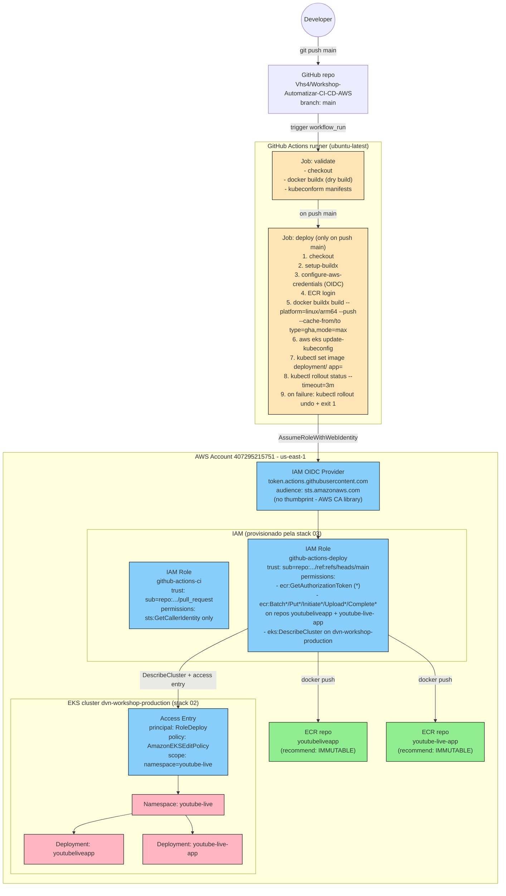

# ADR-0004: CI/CD Pipeline - GitHub Actions com OIDC, Push Model e kubectl set image

## Status

Proposed

## Data

2026-05-24

## Autores

- aws-solution-architect (planejamento e ADR)
- Operador humano (decisoes-chave de design alinhadas em sessao: push model, trigger em main, SHA tag)

## Contexto

O projeto `dvn-workshop` tem hoje 3 stacks deployadas em `us-east-1` (conta `407295215751`):

- `00-remote-backend-stack-ai` (bucket S3 `dvn-workshop-production-terraform-state` com native locking) - ADR-0002
- `01-networking-stack-ai` (VPC `10.0.0.0/24`, 2 AZs, NAT unico, Flow Logs) - ADR-0001
- `02-eks-stack-ai` (cluster EKS `dvn-workshop-production`, K8s 1.33, 2x t4g.small ARM) - ADR-0003

Duas aplicacoes estao no monorepo `github.com/Vhs4/Workshop-Automatizar-CI-CD-AWS`:

- `dvn-workshop-apps/backend/YoutubeLiveApp` - ASP.NET Core 8 Web API
- `dvn-workshop-apps/frontend/youtube-live-app` - Next.js 14 (output standalone)

Ambas ja estao em execucao no cluster (namespace `youtube-live`), com imagens em ECR:

- `407295215751.dkr.ecr.us-east-1.amazonaws.com/youtubeliveapp:v1.0.0`
- `407295215751.dkr.ecr.us-east-1.amazonaws.com/youtube-live-app:v1.0.0`

Manifestos K8s vivem em `k8s/` (namespace + deployment + service por app), aplicados manualmente via `kubectl apply`. Backend exposto como `ClusterIP` interno; frontend exposto via `Service type=LoadBalancer` (Classic ELB `a1b21b499b35b441f94b1ae322ec7173-289152992.us-east-1.elb.amazonaws.com`).

### Por que CI/CD agora

Hoje todo deploy de aplicacao e manual: build local da imagem, push para ECR e `kubectl set image` rodado da maquina do operador com credenciais administrativas. Isso traz tres problemas:

1. **Sem rastreabilidade**: nao ha vinculo entre commit no Git e imagem em producao.
2. **Credenciais de longa duracao** circulam em maquinas de desenvolvimento (chaves IAM ou perfis SSO com permissoes amplas).
3. **Drift entre branches e ambiente**: nada impede um operador buildar de uma branch e empurrar para producao.

A solucao deve ser **simples o suficiente para um workshop didatico** (sem componentes adicionais rodando dentro do cluster) e **segura por padrao** (sem chaves AWS de longa duracao, escopo de role minimo).

### Decisoes-chave ja alinhadas com o operador humano (incorporadas a esta decisao)

Estas escolhas foram explicitamente confirmadas em sessao e nao serao re-discutidas no corpo da decisao - apenas justificadas. Alternativas aparecem somente na secao "Opcoes Consideradas".

1. **Deploy model: PUSH com `kubectl set image`**. GitHub Actions assume role IAM via OIDC, executa `aws eks update-kubeconfig` e roda `kubectl set image deployment/<x> app=<new-image> -n youtube-live`. Nada e instalado no cluster (sem ArgoCD, sem Flux). Justificativa do operador: simplicidade, didatica, zero componentes extras.
2. **Trigger: push em `main`**. PR roda apenas lint/build (validacao), sem deploy. Push em `main` = deploy em production. Como existe um unico ambiente, este e o fluxo viavel.
3. **Image tag strategy: SHA curto do commit** (`${{ github.sha }}` truncado para 7 chars). Tag imutavel, rastreavel ao commit, sem dependencia de semver.

### Constraints reais herdados

- **Restricao de free-tier da conta** (ver ADR-0003): EC2 fora de `t2.micro`/`t3.micro`/`t4g.small` e bloqueada. Isso afeta diretamente a opcao de **self-hosted runner** (caso fosse considerada): o ec2 minimo viavel custaria perto do free-tier ja consumido pelos nodes do EKS. Decisao: usar runner gerenciado do GitHub (`ubuntu-latest`).
- **Imagens ARM obrigatorias**: o cluster roda em `t4g.small` (Graviton/ARM). Toda imagem buildada no CI **deve** ter `--platform=linux/arm64`. Runners do GitHub Actions sao x86 - logo, build precisa usar `docker buildx` com emulacao QEMU ou cross-build nativo.
- **Repositorios ECR ja existem com `imageTagMutability=MUTABLE`** (criados manualmente fora do Terraform). Esta stack assume o gerenciamento via `import` ou marca como `terraform_remote_state` de uma stack futura - ver "Open questions".
- **Stack 00/01/02 ja deployadas**: o cluster esta em estado `ACTIVE`, ECR ja tem `v1.0.0` em ambos os repos, manifestos K8s aplicados. Esta stack **nao altera** infraestrutura ja existente - apenas adiciona componentes IAM/OIDC e cria os workflows que substituem o deploy manual.

## Drivers da Decisao

- **Eliminar credenciais AWS de longa duracao** no GitHub (sem `AWS_ACCESS_KEY_ID` em secrets).
- **Rastreabilidade commit -> imagem -> deploy** (tag = SHA do commit).
- **Operacao day-2 trivial**: nada rodando dentro do cluster para manter.
- **Permissao IAM minima**: roles distintas para PR (read-only) e deploy (push ECR + kubectl no namespace `youtube-live` apenas).
- **Onboarding em workshop**: o pipeline deve ser legivel em ate 100 linhas de YAML, sem dependencias exoticas.
- **Custo zero adicional**: free-tier do GitHub Actions (2000 min/mes em repos publicos = ilimitado) cobre o uso.

## Opcoes Consideradas

A decisao final (push + GHA + OIDC + SHA tag) ja foi tomada. As opcoes abaixo cobrem as **alternativas de design** que foram avaliadas antes de chegar nessa combinacao.

### Eixo 1 - Deploy model: Push vs Pull (GitOps)

#### Opcao 1A: PUSH com `kubectl set image` via GitHub Actions (ESCOLHIDA)

GHA assume role AWS via OIDC, atualiza kubeconfig com `aws eks update-kubeconfig` e executa `kubectl set image deployment/<x> app=<URI:SHA>`.

- **Pros**: zero componentes adicionais no cluster; debug e rollback usando kubectl puro; pipeline auto-contido em um YAML; menor curva de aprendizado.
- **Contras**: o CI precisa de credencial AWS (mitigado por OIDC + escopo minimo); o cluster nao tem registro do "estado desejado" - se alguem editar o deployment via kubectl direto, o proximo push do CI sobrescreve; nao escala bem para muitos apps/clusters.
- **Custo**: $0 adicional.

#### Opcao 1B: PULL / GitOps com ArgoCD

ArgoCD instalado no cluster monitora o repo e aplica manifestos automaticamente. CI apenas builda e empurra para ECR; um segundo passo atualiza um arquivo de "image tags" no repo.

- **Pros**: estado desejado e codigo (drift detection); rollback = revert do commit; auditoria nativa; melhor para multi-cluster/multi-env futuros.
- **Contras**: requer instalar e operar ArgoCD (3 pods minimo, ~250 MB RAM no cluster - significativo em 2x t4g.small de 2 GB); learning curve extra para o workshop; segundo PR/commit para alterar tag adiciona ciclo.
- **Custo**: ~$0 em servicos AWS, mas ~10-15% do RAM disponivel do cluster consumido por ArgoCD.

#### Opcao 1C: PULL com Flux

Similar ao ArgoCD, mais leve (~100 MB RAM), mas com UX inferior e ecossistema menor.

- **Pros**: mais leve que ArgoCD; controllers separados por responsabilidade.
- **Contras**: idem ArgoCD em complexidade; comunidade menor; CLI menos amigavel.
- **Custo**: $0 em AWS.

**Vencedor do eixo 1: Opcao 1A** - alinhado com a diretriz didatica e com a restricao de RAM dos nodes.

---

### Eixo 2 - Trigger model: push-em-main vs tag-trigger vs manual

#### Opcao 2A: Push em `main` dispara deploy (ESCOLHIDA)

Cada merge para `main` builda imagem nova e atualiza o deployment.

- **Pros**: continuous delivery natural; sem ceremonia adicional para promover; alinhado com 1 unico ambiente.
- **Contras**: qualquer merge em main vai para producao - nao ha gate de aprovacao; nao funciona se houver multiplos ambientes (precisaria tag/branch separados).

#### Opcao 2B: Tag git (ex: `v1.2.3`) dispara deploy

Push em main apenas builda artefato; criar uma git tag `v*` dispara o deploy.

- **Pros**: gate humano explicito; tag funciona como release; semver visivel.
- **Contras**: ceremonia extra; em 1 ambiente para workshop e overhead injustificado.

#### Opcao 2C: `workflow_dispatch` (deploy manual)

Sem trigger automatico - operador escolhe quando deployar via UI do GHA.

- **Pros**: 100% controlado.
- **Contras**: nao e CI/CD - e CI + deploy manual; nao atende o objetivo do workshop ("automatizar CI/CD").

**Vencedor do eixo 2: Opcao 2A** - unico ambiente justifica continuous delivery em main; PR roda lint/build sem deploy como gate de qualidade.

---

### Eixo 3 - Image tag strategy: SHA vs Semver vs Latest

#### Opcao 3A: SHA curto do commit (ESCOLHIDA)

`${{ github.sha }}` truncado para 7 chars (ex: `abc1234`).

- **Pros**: imutavel; rastreavel ao commit; sem coordenacao manual de versao; funciona para qualquer estrategia de branch.
- **Contras**: nao e human-friendly; perdemos info de "qual release isso e".

#### Opcao 3B: Semver (`v1.2.3`)

Tag gerada por bump automatico (semantic-release) ou manual via git tag.

- **Pros**: human-friendly; semantica clara de breaking/feature/patch.
- **Contras**: requer coordenacao ou tool de versionamento; pouco valor em monorepo de 2 apps de workshop.

#### Opcao 3C: `latest`

Cada build sobrescreve `latest` e o cluster sempre pulla `latest`.

- **Pros**: simplicidade absoluta.
- **Contras**: **anti-pattern critico** - sem rastreabilidade, rollback impossivel, `imagePullPolicy=IfNotPresent` em K8s torna a tag sem efeito ate o pod reiniciar, e `imagePullPolicy=Always` aumenta cold-start sem ganho.

**Vencedor do eixo 3: Opcao 3A** - SHA imutavel resolve rastreabilidade sem overhead.

---

### Eixo 4 - Onde mora a infraestrutura AWS para o pipeline

#### Opcao 4A: Nova stack Terraform `03-cicd-stack-ai` (ESCOLHIDA)

Cria-se uma quarta stack no padrao do repo, com: `aws_iam_openid_connect_provider` (GitHub), `aws_iam_role` para PR (build/test sem credenciais AWS reais), `aws_iam_role` para deploy (push ECR + kubectl), policies inline, `aws_eks_access_entry` + `aws_eks_access_policy_association` no cluster.

- **Pros**: consistente com a convencao do repo; outputs (`role_arn`, `oidc_provider_arn`) ficam disponiveis para os workflows como secrets/vars do GitHub; tudo versionado e auditavel.
- **Contras**: mais um stack no `terraform-deploy` skill.

#### Opcao 4B: Adicionar tudo dentro da `02-eks-stack-ai`

Misturar OIDC provider + roles + access entries no mesmo stack do cluster.

- **Pros**: menos stacks para gerenciar.
- **Contras**: viola separacao de responsabilidades - mudancas em CI/CD forcam plan/apply do cluster inteiro; aumenta blast radius de cada deploy.

#### Opcao 4C: ClickOps (criar manualmente via console)

Sem IaC.

- **Pros**: rapido para prototipar.
- **Contras**: anti-pattern para este repo (todo o resto e IaC); sem versionamento.

**Vencedor do eixo 4: Opcao 4A** - stack separada `03-cicd-stack-ai`.

---

### Eixo 5 - Estrutura de workflows: 1 por app vs matrix com detector

#### Opcao 5A: Um workflow por app, com `paths:` filter (ESCOLHIDA)

`.github/workflows/backend.yml` triggera em `dvn-workshop-apps/backend/**` e `k8s/youtubeliveapp/**`. Mesma coisa para frontend.

- **Pros**: legivel; concorre independentemente; falha de um nao afeta o outro; debug isolado.
- **Contras**: duplicacao parcial (2 arquivos quase iguais).

#### Opcao 5B: Um workflow `deploy.yml` com matrix e `dorny/paths-filter`

Detecta o que mudou e processa em matrix.

- **Pros**: DRY; um lugar so para tunar.
- **Contras**: mais complexo de ler; falha de matrix em um item polui o status do outro; usa action de terceiros (`dorny/paths-filter`) - supply chain extra.

**Vencedor do eixo 5: Opcao 5A** - clareza > DRY em workshop com 2 apps.

---

### Eixo 6 - Smoke test pos-deploy: como verificar saude

#### Opcao 6A: `kubectl rollout status --timeout=3m` (ESCOLHIDA como base)

Aguarda o rollout converger. Se nao converge no timeout, marca o run como failed.

- **Pros**: nativo do K8s; valida que o novo ReplicaSet ficou pronto e o antigo foi escalado para 0; nao requer egress nem service exposto.
- **Contras**: nao testa funcionalidade HTTP - apenas que pods subiram com readiness probe OK.

#### Opcao 6B: `kubectl run` de um pod efemero que faz `curl http://<service>:<port>/healthz`

Job efemero dentro do cluster valida HTTP.

- **Pros**: testa de verdade que o app responde.
- **Contras**: requer endpoint `/healthz` em ambos os apps (frontend Next.js nao tem por padrao); adiciona ~30s ao pipeline; mais codigo no workflow.

#### Opcao 6C: Curl externo (via ELB do frontend) do runner GHA

Para o frontend que tem `LoadBalancer`, dispara `curl` da maquina do runner.

- **Pros**: testa end-to-end real.
- **Contras**: backend e ClusterIP - precisaria port-forward; ELB pode demorar a refletir; o runner tem outbound NAT do GHA, nao do cluster - testa rede publica, nao o caminho do usuario.

**Vencedor do eixo 6: Opcao 6A** - `rollout status` e suficiente; Opcao 6B e marcada como "evolucao futura" quando os apps tiverem healthcheck dedicado.

## Decisao

Implementar **CI/CD com GitHub Actions usando OpenID Connect federation para AWS, deploy model PUSH com `kubectl set image`, trigger em push para `main`, image tags com SHA curto do commit**, e provisionar todo o lado AWS via nova stack Terraform `03-cicd-stack-ai`.

### Componentes da decisao

1. **Nova stack `dvn-workshop-terraform/03-cicd-stack-ai`** provisiona:
   - `aws_iam_openid_connect_provider` para `https://token.actions.githubusercontent.com` com `client_id_list = ["sts.amazonaws.com"]`. **Sem `thumbprint_list`**: o provider AWS v6.46.0 documenta explicitamente que para GitHub, GitLab, Google e Auth0 a validacao usa a CA library da AWS, e o `thumbprint_list` quando informado e ignorado. Omitir simplifica o codigo e evita drift quando o GitHub rotacionar certificado.
   - `aws_iam_role.github_actions_ci` (PR builds) - trust policy com `sub` claim filtrado por `repo:Vhs4/Workshop-Automatizar-CI-CD-AWS:pull_request`. Sem permissoes AWS reais (apenas `sts:GetCallerIdentity` para teste opcional). Esta role existe para validar que o trust funciona em PRs sem expor permissoes de deploy.
   - `aws_iam_role.github_actions_deploy` (main branch) - trust policy com `sub` claim filtrado por `repo:Vhs4/Workshop-Automatizar-CI-CD-AWS:ref:refs/heads/main`. Permissoes inline (ver "Seguranca"):
     - ECR push limitado aos 2 repos (`youtubeliveapp`, `youtube-live-app`).
     - `eks:DescribeCluster` apenas no cluster `dvn-workshop-production`.
   - `aws_eks_access_entry` (type `STANDARD`) para a role `github_actions_deploy`.
   - `aws_eks_access_policy_association` com `policy_arn = arn:aws:eks::aws:cluster-access-policy/AmazonEKSEditPolicy` e `access_scope { type = "namespace", namespaces = ["youtube-live"] }`. **Validado via doc oficial (2026)**: `AmazonEKSEditPolicy` inclui `create/delete/patch/update` para `deployments` no apiGroup `apps`, que e exatamente o que `kubectl set image deployment/...` e `kubectl rollout undo` precisam.

2. **Workflows GitHub Actions** (vivem em `.github/workflows/` do repo, **nao** sao IaC desta stack):
   - `backend.yml` - paths filter em `dvn-workshop-apps/backend/**` e `k8s/youtubeliveapp/**`.
   - `frontend.yml` - paths filter em `dvn-workshop-apps/frontend/**` e `k8s/youtube-live-app/**`.
   - Cada workflow tem 2 jobs: `validate` (em todo evento, inclusive PR) e `deploy` (apenas em push para `main`, depende de `validate`).
   - `concurrency.group = "<app>-${{ github.ref }}"` com `cancel-in-progress: false` para evitar deploys concorrentes do mesmo app na mesma branch.

3. **ECR `imageTagMutability=IMMUTABLE`** (mudanca recomendada). Os 2 repos existentes hoje sao `MUTABLE`. Com SHA imutavel a mutabilidade ja nao importa em pratica, mas trocar para `IMMUTABLE` adiciona defesa em profundidade contra:
   - Operador que tentar `docker tag x:abc1234 ... && docker push` por engano (vai falhar com `ImageTagAlreadyExistsException`).
   - Compromisso de credencial que tente sobrescrever uma imagem ja deployada.
   - Esta stack `03-cicd-stack-ai` **nao** gerencia os repos ECR (eles existem fora do IaC hoje). A recomendacao e: criar uma stack futura `04-ecr-stack-ai` que faca `import` dos repos existentes e os configure com `image_tag_mutability = "IMMUTABLE"`. Por ora, esta stack documenta a recomendacao mas nao atua nela - ver "Open questions".

### Justificativa contra os 6 pilares do Well-Architected

| Pilar | Justificativa | Trade-off aceito |
|---|---|---|
| **Operational Excellence** | Pipeline auto-contido em YAML versionado; rollback automatico via `kubectl rollout undo` em caso de falha do rollout; nada para operar dentro do cluster; logs centralizados na UI do GHA com retencao gratuita de 90 dias. | Operador ainda precisa intervir manualmente se o `kubectl rollout undo` tambem falhar (cenario raro - rollback so falha se o manifesto antigo tambem estiver quebrado). |
| **Security** | Sem chaves AWS de longa duracao no GitHub (OIDC federation com tokens de ate 1h); 2 roles distintas (PR vs deploy) com escopo de `sub` claim restrito por branch; permissao ECR limitada aos 2 repos da aplicacao; permissao K8s limitada ao namespace `youtube-live` via `AmazonEKSEditPolicy` (sem cluster-admin); ECR `IMMUTABLE` recomendada para impedir sobrescrita; supply chain das actions pinada por SHA (nao por tag). | Risco residual: GitHub Actions tem acesso a `kubectl` no namespace - um workflow comprometido pode deletar deployments do namespace. Mitigado por: branch protection em main, code owners obrigatorios em mudancas de `.github/workflows/**`. |
| **Reliability** | `kubectl rollout status --timeout=3m` garante que o novo deployment converge antes de marcar success; rollback automatico para o ReplicaSet anterior em caso de falha; concurrency group evita deploys sobrepostos do mesmo app. | Deploy de backend e frontend nao sao coordenados - se uma feature exige mudanca em ambos, podem ficar inconsistentes por alguns segundos durante o deploy. Aceitavel para workshop. |
| **Performance Efficiency** | Cache `type=gha` no buildx reduz tempo de build em ~60-80% apos o primeiro build (camadas Docker reaproveitadas); paths filter evita build/deploy desnecessario quando so mudou doc ou IaC; concurrency group cancela deploys obsoletos em PRs. | Build cross-platform `linux/arm64` em runner x86 usa QEMU - ~2-3x mais lento que build nativo. Aceitavel porque o tempo total fica abaixo de 5 min com cache. |
| **Cost Optimization** | GitHub Actions free-tier em repo publico = ilimitado; ECR storage estimado em < 1 GB/mes ($0.10/GB); ECR data transfer dentro da regiao para o cluster = $0; OIDC provider IAM = $0; access entries = $0. Custo incremental total: **~$0.10/mes**. | Nenhum trade-off relevante. |
| **Sustainability** | Cache de camadas Docker reduz reconstrucao e tempo de CPU dos runners; build so quando ha mudanca real (paths filter); imagens ARM ja sao mais eficientes em performance/watt. | Emulacao QEMU para cross-build consome mais CPU/energia que build nativo - mitigado pelo cache que reduz frequencia de rebuilds. |

## Consequencias

### Positivas

- Credenciais AWS de longa duracao saem completamente do GitHub (apenas OIDC).
- Cada deploy e auditavel: SHA do commit -> imagem ECR -> deployment K8s.
- Onboarding novo: clonar o repo, abrir PR, ver o workflow rodando - pronto.
- Custo praticamente zero.
- Stack `03-cicd-stack-ai` reutilizavel para futuras aplicacoes do projeto (basta adicionar mais repos ao bloco de permissao ECR).

### Negativas / Trade-offs aceitos

- Push model significa que o cluster nao tem fonte de verdade declarativa - state vive no Git mas o cluster nao audita drift sozinho. Se alguem rodar `kubectl edit deployment` direto, o proximo push do CI sobrescreve sem aviso.
- 2 workflows quase identicos (backend.yml e frontend.yml) - duplicacao aceita em favor de clareza.
- Sem ambiente intermediario (staging) - cada push em main vai para producao. Risco mitigado por: lint/build obrigatorio em PR; rollback automatico via `kubectl rollout undo` se o deploy falhar.
- Build ARM em runner x86 com QEMU adiciona ~1-2 min ao tempo de build.

### Neutras

- O workshop ganha um arquivo `.tf` a mais e dois `.yml` a mais para ensinar/manter.
- Operador local **ainda pode** fazer `kubectl apply` manualmente em emergencias - o CI nao tem exclusividade do cluster.

## Diagrama



## Validacao via MCP

Confirmacoes realizadas em 2026-05-24:

**Terraform MCP (`mcp__terraform__*`)**
- `get_latest_provider_version(hashicorp/aws)` retornou `6.46.0` - confirma o pin `~> 6.0` herdado dos ADRs anteriores.
- `search_providers(iam_openid_connect_provider, resources)` -> doc id `12310858`. Doc completa confirma:
  - `thumbprint_list` e **opcional**; explicitamente documenta que para "Auth0, GitHub, GitLab, Google, or those using an Amazon S3-hosted JWKS endpoint, AWS relies on its own library of trusted root certificate authorities (CAs) for validation instead of using any configured thumbprints". **Decisao: omitir `thumbprint_list`.**
  - `url` (required) e `client_id_list` (required) sao os unicos campos necessarios.
- `search_providers(iam_role, resources)` -> doc id `12310863` (validado, mesmo recurso ja usado em ADR-0003).
- `search_providers(iam_role_policy, resources)` -> doc id `12310865`.
- `search_providers(iam_role_policy_attachment, resources)` -> doc id `12310866`.
- `search_providers(iam_policy_document, data-sources)` -> doc id `12309752`.
- `search_providers(ecr_repository, resources)` -> doc id `12310697` (para futura stack `04-ecr-stack-ai`).
- `aws_eks_access_entry` (doc id `12310721`) e `aws_eks_access_policy_association` (doc id `12310722`) ja confirmados no ADR-0003.

**AWS MCP (`mcp__aws-mcp__*`)**
- `search_documentation` + `read_documentation` sobre OIDC GitHub Actions confirmaram:
  - URL canonica do IdP: `https://token.actions.githubusercontent.com` (case-sensitive, lowercase).
  - Audience: `sts.amazonaws.com`.
  - Action oficial recomendada: `aws-actions/configure-aws-credentials` (versionada por SHA no workflow para evitar supply chain).
  - Padrao de sub claim: `repo:<org>/<repo>:<ref-spec>` onde `<ref-spec>` pode ser `ref:refs/heads/<branch>`, `pull_request`, `environment:<name>`, `ref:refs/tags/<tag>`.
- **Novidade descoberta** (atualizacao da AWS publicada em 2026-02-02): STS agora valida claims especificos do GitHub alem de `sub`/`aud`. Claims como `job_workflow_ref`, `repository_owner_id`, `actor` podem ser usados como condition keys em trust policies para hardening adicional. Ref: https://aws.amazon.com/about-aws/whats-new/2026/01/aws-sts-supports-validation-identity-provider-claims/. **Decisao**: usar `sub` para o MVP do workshop; documentar `job_workflow_ref` como hardening futuro em "Open questions".
- `read_documentation(eks/access-policy-permissions)` confirmou:
  - `AmazonEKSEditPolicy` ARN: `arn:aws:eks::aws:cluster-access-policy/AmazonEKSEditPolicy`.
  - Inclui `create/delete/deletecollection/patch/update` em `deployments`, `deployments/scale`, `deployments/rollback` no apiGroup `apps`. **Confirma** que `kubectl set image deployment/<x>` e `kubectl rollout undo` funcionam com este escopo.
  - Suporta `access_scope.type = "namespace"` para restringir aos namespaces listados.
- `read_documentation(ecr/image-tag-mutability)` confirmou:
  - `IMMUTABLE` retorna `ImageTagAlreadyExistsException` em push duplicado.
  - Suporta `IMMUTABLE_WITH_EXCLUSION` com filtros wildcard (util caso queira manter `latest` mutavel - **nao usaremos**).
  - Setting pode ser alterado em repo existente via `put-image-tag-mutability`.

**Correcoes a ADRs anteriores**: nenhuma. ADR-0003 cita `provider hashicorp/aws ~> 6.0 resolvido para 6.46.0` - segue valido em 2026-05-24.

## Implementation Guidelines (para o DevOps Engineer Agent)

### IaC stack

- **Terraform**: `>= 1.10.0` (heranca dos ADRs anteriores).
- **Provider**: `hashicorp/aws ~> 6.0` (resolvera para `6.46.0` em 2026-05-24).
- **Backend**: S3 (stack 00). Bucket `dvn-workshop-production-terraform-state`, key `cicd/terraform.tfstate`, region `us-east-1`, `use_lockfile = true`, `encrypt = true`.
- **Remote state da stack 02** (EKS): `terraform_remote_state` apontando para `eks/terraform.tfstate`, para puxar `eks_cluster_name` e `eks_cluster_arn`.

### Estrutura de arquivos esperada (em `dvn-workshop-terraform/03-cicd-stack-ai/`)

| Arquivo | Conteudo |
|---|---|
| `versions.tf` | `terraform {}` com `required_version`, `required_providers`, `backend "s3"` |
| `main.tf` | `provider "aws"` (region, default_tags), `data "terraform_remote_state" "eks"`, `data "aws_caller_identity" "current"`, `data "aws_partition" "current"` |
| `variables.tf` | declaracao das variaveis (todas em `object({...})`, sem `default`) |
| `outputs.tf` | outputs (ver abaixo) |
| `tags.tf` | `locals.tags` consolidando project/environment/stack/managed_by |
| `oidc.tf` | `aws_iam_openid_connect_provider.github` |
| `iam.github-ci.tf` | role `github_actions_ci` + trust policy doc + (sem permissoes adicionais alem de `sts:GetCallerIdentity` implicito) |
| `iam.github-deploy.tf` | role `github_actions_deploy` + trust policy doc + `aws_iam_role_policy.ecr_push` + `aws_iam_role_policy.eks_describe` |
| `eks.access.tf` | `aws_eks_access_entry.github_deploy` + `aws_eks_access_policy_association.github_deploy_edit_namespace` |
| `envs/production.tfvars` | valores das variaveis para production |

### Variaveis (esqueleto, sem valores)

```hcl
# variables.tf

variable "aws_region" {
  description = "AWS region for the CI/CD stack"
  type        = string
  nullable    = false
}

variable "project" {
  description = "Project identification used for naming and tagging"
  type = object({
    name        = string  # "dvn-workshop"
    environment = string  # "production"
  })
  nullable = false
}

variable "eks_remote_state" {
  description = "Remote state config for the EKS stack outputs"
  type = object({
    bucket = string
    key    = string  # "eks/terraform.tfstate"
    region = string
  })
  nullable = false
}

variable "github" {
  description = "GitHub OIDC and repository configuration"
  type = object({
    organization     = string  # "Vhs4"
    repository       = string  # "Workshop-Automatizar-CI-CD-AWS"
    deploy_branch    = string  # "main"
    ci_role_name     = string  # "github-actions-ci"
    deploy_role_name = string  # "github-actions-deploy"
  })
  nullable = false
}

variable "ecr_repository_names" {
  description = "ECR repositories the deploy role is allowed to push to"
  type        = list(string)  # ["youtubeliveapp", "youtube-live-app"]
  nullable    = false
}

variable "eks_deploy_namespace" {
  description = "Kubernetes namespace where deploy role can act"
  type        = string  # "youtube-live"
  nullable    = false
}
```

### Trust policy do role de deploy (estrutura)

Usar `data "aws_iam_policy_document"` com:

- `Effect = "Allow"`, `Actions = ["sts:AssumeRoleWithWebIdentity", "sts:TagSession"]`.
- `Principals { type = "Federated", identifiers = [aws_iam_openid_connect_provider.github.arn] }`.
- `Condition StringEquals` em `token.actions.githubusercontent.com:aud` = `sts.amazonaws.com`.
- `Condition StringEquals` em `token.actions.githubusercontent.com:sub` = `repo:${var.github.organization}/${var.github.repository}:ref:refs/heads/${var.github.deploy_branch}`.

Para o role de CI:
- Mesmas Actions/Principals.
- `Condition StringLike` em `:sub` = `repo:${var.github.organization}/${var.github.repository}:pull_request`.

**Critico**: usar `StringEquals` (nao `StringLike` com wildcard) para o role de deploy. Wildcard mal-formado e a falha de seguranca classica em OIDC (qualquer fork ou branch poderia assumir a role).

### Permissoes inline do role de deploy (estrutura)

Policy 1 - `ecr-auth` (acoes que so funcionam com `Resource = "*"`):

```
Effect = Allow
Actions = ["ecr:GetAuthorizationToken"]
Resource = "*"
```

Policy 2 - `ecr-push` (push limitado aos 2 repos):

```
Effect = Allow
Actions = [
  "ecr:BatchCheckLayerAvailability",
  "ecr:BatchGetImage",
  "ecr:CompleteLayerUpload",
  "ecr:DescribeImages",
  "ecr:DescribeRepositories",
  "ecr:GetDownloadUrlForLayer",
  "ecr:InitiateLayerUpload",
  "ecr:PutImage",
  "ecr:UploadLayerPart",
  "ecr:TagResource"
]
Resource = [
  for r in var.ecr_repository_names :
    "arn:${data.aws_partition.current.partition}:ecr:${var.aws_region}:${data.aws_caller_identity.current.account_id}:repository/${r}"
]
```

Policy 3 - `eks-describe` (apenas para `aws eks update-kubeconfig`):

```
Effect = Allow
Actions = ["eks:DescribeCluster"]
Resource = data.terraform_remote_state.eks.outputs.eks_cluster_arn
```

### Access entry no cluster EKS

```hcl
resource "aws_eks_access_entry" "github_deploy" {
  cluster_name  = data.terraform_remote_state.eks.outputs.eks_cluster_name
  principal_arn = aws_iam_role.github_actions_deploy.arn
  type          = "STANDARD"
}

resource "aws_eks_access_policy_association" "github_deploy_edit" {
  cluster_name  = data.terraform_remote_state.eks.outputs.eks_cluster_name
  principal_arn = aws_iam_role.github_actions_deploy.arn
  policy_arn    = "arn:${data.aws_partition.current.partition}:eks::aws:cluster-access-policy/AmazonEKSEditPolicy"

  access_scope {
    type       = "namespace"
    namespaces = [var.eks_deploy_namespace]
  }

  depends_on = [aws_eks_access_entry.github_deploy]
}
```

### Outputs

```hcl
output "github_oidc_provider_arn"      { value = aws_iam_openid_connect_provider.github.arn }
output "github_actions_ci_role_arn"    { value = aws_iam_role.github_actions_ci.arn }
output "github_actions_deploy_role_arn"{ value = aws_iam_role.github_actions_deploy.arn }
output "github_repo_fullname"          { value = "${var.github.organization}/${var.github.repository}" }
```

O engineer deve copiar `github_actions_deploy_role_arn` para o GitHub como **variable** (nao secret - ARN nao e secreto) chamada `AWS_DEPLOY_ROLE_ARN`.

### Ordem de execucao e dependencias

```
0. (pre-req) stacks 00, 01, 02 deployadas
1. versions.tf + backend init                    -> terraform init
2. tags.tf + variables.tf                        -> declaracao
3. main.tf                                       -> provider + data sources + remote state EKS
4. oidc.tf                                       -> OIDC provider
5. iam.github-ci.tf                              -> role CI + trust
6. iam.github-deploy.tf                          -> role deploy + trust + 3 inline policies
7. eks.access.tf                                 -> access entry + policy association no namespace
8. /terraform-deploy 03-cicd-stack-ai            -> apply
9. Copiar outputs para GitHub Actions vars       -> AWS_DEPLOY_ROLE_ARN, AWS_REGION, AWS_ACCOUNT_ID
```

### Workflows GitHub Actions (NAO faz parte desta stack Terraform - vai em `.github/workflows/`)

**Estrutura comum dos 2 workflows** (`backend.yml`, `frontend.yml`):

```yaml
name: <app>
on:
  pull_request:
    paths: ['dvn-workshop-apps/<app>/**', 'k8s/<manifest-dir>/**']
  push:
    branches: [main]
    paths: ['dvn-workshop-apps/<app>/**', 'k8s/<manifest-dir>/**']

permissions:
  id-token: write   # MANDATORY for OIDC
  contents: read

concurrency:
  group: <app>-${{ github.ref }}
  cancel-in-progress: false

jobs:
  validate:
    runs-on: ubuntu-latest
    steps:
      - checkout (actions/checkout pinned by SHA)
      - setup-buildx (docker/setup-buildx-action pinned by SHA)
      - docker buildx build --platform=linux/arm64 --load (no push, validate Dockerfile)
      - (optional) kubeconform on k8s manifests

  deploy:
    if: github.event_name == 'push' && github.ref == 'refs/heads/main'
    needs: validate
    runs-on: ubuntu-latest
    env:
      AWS_REGION: us-east-1
      ECR_REGISTRY: ${{ vars.AWS_ACCOUNT_ID }}.dkr.ecr.us-east-1.amazonaws.com
      ECR_REPO: <app-ecr-repo-name>
      DEPLOYMENT: <k8s-deployment-name>
      NAMESPACE: youtube-live
      CLUSTER: dvn-workshop-production
    steps:
      - checkout (pinned by SHA)
      - setup-qemu (linux/arm64 emulation)
      - setup-buildx (pinned by SHA)
      - aws-actions/configure-aws-credentials (pinned by SHA):
          role-to-assume: ${{ vars.AWS_DEPLOY_ROLE_ARN }}
          aws-region: ${{ env.AWS_REGION }}
      - aws-actions/amazon-ecr-login (pinned by SHA)
      - Compute SHORT_SHA: echo "SHORT_SHA=$(echo $GITHUB_SHA | cut -c1-7)" >> $GITHUB_ENV
      - docker buildx build:
          --platform=linux/arm64
          --push
          --cache-from type=gha,scope=<app>
          --cache-to type=gha,mode=max,scope=<app>
          -t $ECR_REGISTRY/$ECR_REPO:$SHORT_SHA
          ./dvn-workshop-apps/<app-path>
      - aws eks update-kubeconfig --region $AWS_REGION --name $CLUSTER
      - kubectl set image deployment/$DEPLOYMENT app=$ECR_REGISTRY/$ECR_REPO:$SHORT_SHA -n $NAMESPACE
      - kubectl rollout status deployment/$DEPLOYMENT -n $NAMESPACE --timeout=3m
      - on failure: kubectl rollout undo deployment/$DEPLOYMENT -n $NAMESPACE && exit 1
```

**Notas para o engineer ao escrever os workflows**:

- **Pin actions por SHA**, nao por tag (`actions/checkout@<commit-sha>` ao inves de `@v4`). Defesa contra supply chain.
- O nome do `container` dentro do Pod (`app=...`) precisa bater com `spec.template.spec.containers[].name` nos manifestos K8s atuais - validar lendo `k8s/youtubeliveapp/20-deployment.yaml` e `k8s/youtube-live-app/20-deployment.yaml` antes de escrever o workflow. Se o nome do container atual nao for `app`, ajustar.
- O passo de `kubectl rollout status` **deve** ter `continue-on-error: false` (default) - se rollout nao convergir em 3 min, o passo seguinte de rollback roda.
- `vars.AWS_DEPLOY_ROLE_ARN` e `vars.AWS_ACCOUNT_ID` sao **variables** do repo no GitHub (Settings -> Secrets and variables -> Actions -> Variables tab), nao secrets.

### Validacoes pos-deploy desta stack

1. `aws iam list-open-id-connect-providers` retorna o ARN do provider `token.actions.githubusercontent.com`.
2. `aws iam get-role --role-name github-actions-deploy` retorna trust policy com `sub` filtrado em main.
3. `aws eks list-access-entries --cluster-name dvn-workshop-production` lista o ARN do role `github-actions-deploy`.
4. `aws eks list-associated-access-policies --cluster-name dvn-workshop-production --principal-arn <deploy-role-arn>` mostra `AmazonEKSEditPolicy` com `scope.type=namespace, namespaces=[youtube-live]`.
5. Teste end-to-end: abrir um PR de teste mudando um arquivo dentro de `dvn-workshop-apps/backend/` -> job `validate` roda; mergear -> job `deploy` builda, pusha imagem com tag SHA, atualiza deployment, rollout converge.
6. CloudTrail event `AssumeRoleWithWebIdentity` aparece com `userIdentity.sessionContext.sessionIssuer.arn` = role de deploy e `requestParameters.webIdentityToken` decodificavel via jwt.io (sem o secret) mostrando `sub: repo:Vhs4/Workshop-Automatizar-CI-CD-AWS:ref:refs/heads/main`.

### Rollback strategy (desta stack)

- `terraform destroy -var-file=envs/production.tfvars` remove tudo na ordem inversa: access policy association -> access entry -> IAM role policies -> IAM roles -> OIDC provider.
- **Atencao**: destruir o OIDC provider quebra TODOS os workflows do repo imediatamente. Se for necessario revogar acesso pontual, preferir `terraform apply` com a role removida (mantendo o OIDC provider).
- Se um deploy individual falhar, o rollback acontece dentro do workflow via `kubectl rollout undo` - nao envolve esta stack.

## Observabilidade e Day-2

### Logs do pipeline
- **GHA UI** e o destino default - retencao gratuita de 90 dias para repos publicos. Suficiente para o workshop.
- **Sem integracao com CloudWatch** nesta versao. Justificativa: CloudWatch Logs ingestion cobra $0.50/GB; logs de pipeline duplicariam custo sem ganho operacional num workshop. Marcado em "Open questions" como evolucao opcional.

### Metricas do pipeline (visiveis na UI do GHA)
- Duracao do workflow (alvo: < 5 min com cache, < 8 min sem cache).
- Taxa de sucesso (alvo: > 95%).
- Frequencia de deploy (DORA metric).

### Alarmes
- **Nao habilitados nesta versao**. Para o workshop, a propria UI do GHA notifica via email em failures. Em projeto real, considerar:
  - GHA -> Slack webhook em deploy failures.
  - CloudWatch alarm em `AssumeRoleWithWebIdentity` failures repetidos (sinaliza trust policy quebrado ou credencial comprometida tentando re-assumir).

### Runbooks necessarios (a serem criados pelo engineer apos primeira execucao bem-sucedida)
- **RB-CICD-001**: Rotacionar role ARN exposto acidentalmente em logs publicos (recriar role -> atualizar `AWS_DEPLOY_ROLE_ARN` var no GitHub -> destruir role antiga).
- **RB-CICD-002**: Debug de `AssumeRoleWithWebIdentity` failure (validar `sub` claim no jwt.io contra trust policy).
- **RB-CICD-003**: Rollback manual quando o automatico falhar (`kubectl rollout undo` direto + investigar root cause).
- **RB-CICD-004**: Adicionar nova aplicacao ao pipeline (criar novo ECR repo -> adicionar nome em `ecr_repository_names` -> apply stack -> criar `.github/workflows/<app>.yml`).

## Seguranca

### OIDC trust claims
- `aud = sts.amazonaws.com` (audiencia padrao para STS).
- `sub` em **StringEquals** (nao StringLike):
  - CI role: `repo:Vhs4/Workshop-Automatizar-CI-CD-AWS:pull_request`
  - Deploy role: `repo:Vhs4/Workshop-Automatizar-CI-CD-AWS:ref:refs/heads/main`
- **Risco mitigado**: usar StringLike com wildcard (`repo:Vhs4/*:*`) permitiria qualquer branch/fork assumir a role. **Nao fazer.**

### IAM least-privilege
- Deploy role nao tem `*:*` em nenhum recurso.
- Permissoes ECR limitadas aos 2 repos especificos por ARN.
- Permissao EKS limitada ao cluster especifico por ARN.
- Acesso K8s limitado ao namespace `youtube-live` via Access Entry com `AmazonEKSEditPolicy` (sem cluster-admin).
- CI role tem zero permissoes AWS (apenas valida que o trust funciona).

### Segredos
- **Nao ha segredos** nesta arquitetura. Apenas **variables** publicas:
  - `AWS_DEPLOY_ROLE_ARN` - ARN nao e secreto.
  - `AWS_ACCOUNT_ID` - ID nao e secreto (ja aparece em ECR URI).
- Tokens OIDC sao gerados sob demanda pelo GitHub a cada run, vivem ate 1h.

### Supply chain das actions
- Pinar `actions/checkout`, `docker/setup-buildx-action`, `docker/setup-qemu-action`, `aws-actions/configure-aws-credentials`, `aws-actions/amazon-ecr-login` por **SHA do commit** (nao por `@v4`). Defesa contra release malicioso de versao.
- Recomendar dependabot ou renovate para atualizar SHAs periodicamente com PRs revisaveis.

### Branch protection (configuracao manual no GitHub, fora desta stack)
- Proteger branch `main`: requer PR + 1 reviewer + checks passando.
- `CODEOWNERS` para `.github/workflows/**` exigindo aprovacao de owner especifico - impede que um colaborador comum altere o workflow para escalar permissoes.

### Hardening futuro
- Migrar trust policy para validar `job_workflow_ref` (claim disponivel desde fev/2026 - ver "Validacao via MCP"). Isso garante que a role so pode ser assumida por um workflow especifico (`Vhs4/Workshop-Automatizar-CI-CD-AWS/.github/workflows/backend.yml@refs/heads/main`), nao apenas pela branch.
- Adicionar `aws_iam_role.session_duration = 3600` (1h) explicitamente - default e 1h mas tornar explicito.

## Custo Estimado

### Mensal aproximado (us-east-1, valores em USD, 2026-05)

| Componente | Custo |
|---|---|
| GitHub Actions runner (free-tier repo publico) | $0 |
| IAM OIDC provider | $0 |
| IAM roles + policies | $0 |
| EKS Access Entry + Policy Association | $0 |
| ECR storage (~500 MB de imagens com ~10 SHAs ativas, gp2 logica) | ~$0.05 |
| ECR data transfer (mesma regiao para EKS) | $0 |
| CloudTrail events (`AssumeRoleWithWebIdentity` etc) | $0 (incluso no trail default) |
| **TOTAL** | **~$0.10/mes** |

### Principais drivers
- Praticamente nulo. Crescimento de ECR storage e o unico variavel - mitigado por:
  - Lifecycle policy nos repos ECR (manter ultimas N imagens). Recomendado fortemente como parte da stack futura `04-ecr-stack-ai`.

### Oportunidades de otimizacao futura
- **ECR lifecycle policy**: deletar imagens com tag SHA mais antigas que 30 dias e nao referenciadas. Reduz storage ~80%.
- **Self-hosted ARM runner** (futuro, se sair do free-tier): build nativo ARM elimina QEMU e reduz tempo de build pela metade. Custo: ~$5-10/mes em t4g.small. **Nao recomendado agora** pela restricao de free-tier da conta.

## Riscos e mitigacoes

| Risco | Probabilidade | Impacto | Mitigacao |
|---|---|---|---|
| Trust policy com wildcard mal-formado permite qualquer fork assumir a role | Baixa (StringEquals exato no design) | Critico (acesso total ao ECR + cluster) | Code review obrigatorio em PR que altere `iam.github-deploy.tf`; CODEOWNERS para `.github/workflows/**`; teste explicito via fork de validacao apos primeiro deploy. |
| Workflow YAML alterado em PR para escalar permissoes | Media | Alto | `CODEOWNERS` para `.github/workflows/**` exigindo owner; branch protection em `main`. |
| Imagem buildada em x86 por engano (sem `--platform=linux/arm64`) | Media | Alto (pod crashloop em t4g) | Step explicito de `docker manifest inspect` no workflow validando que `architecture=arm64`. |
| `kubectl set image` em deployment inexistente | Baixa | Medio | Adicionar `kubectl get deployment/$DEPLOYMENT -n $NAMESPACE` antes do set image - falha rapida e clara. |
| Cache GHA corrompido produz imagem invalida | Muito baixa | Medio | `--cache-from type=gha,scope=<app>` - se cache corrompe, build cai para fresh; manual workaround: limpar cache via UI do GHA. |
| ECR cobra storage acumulado de SHAs antigos | Media (cresce com tempo) | Baixo | Lifecycle policy na stack futura `04-ecr-stack-ai`. |
| Operador roda `kubectl edit deployment` manual e CI sobrescreve sem aviso | Media | Baixo | Documentar no runbook: edits manuais sao efemeros; mudar imagem so via CI. |
| OIDC provider destruido por engano quebra TODOS os deploys | Baixa | Critico | `lifecycle { prevent_destroy = true }` no `aws_iam_openid_connect_provider.github`. |

## Rollback strategy

### Rollback de deploy individual (escopo: 1 app)
- **Automatico**: se `kubectl rollout status --timeout=3m` falha, o workflow roda `kubectl rollout undo deployment/<x> -n youtube-live` e marca o run como failed.
- **Manual** (caso o automatico tambem falhe): operador executa `kubectl rollout undo deployment/<x> -n youtube-live` localmente. Como o operador tem acesso administrativo direto, isso sempre funciona.

### Rollback de um commit ruim ja deployado (escopo: codigo)
- Revert do commit em `main` -> push -> CI builda imagem nova com SHA do revert -> deployment atualizado automaticamente. Tempo total: ~5 min.

### Rollback desta stack (escopo: infraestrutura CI/CD)
- Ver "Implementation Guidelines -> Rollback strategy" acima.

## Open Questions

Itens que ainda precisam de input do humano ou decisao futura - **nao** bloqueiam a implementacao desta stack:

1. **Stack `04-ecr-stack-ai`**: criar uma stack dedicada que faca `import` dos 2 repos ECR existentes, aplique `image_tag_mutability = "IMMUTABLE"` e lifecycle policy. Quem prioriza? Quando?
2. **Validacao de `job_workflow_ref`**: migrar trust policy do role de deploy para tambem validar este claim (hardening pos-fev/2026). Necessario priorizar?
3. **Smoke test HTTP**: adicionar endpoint `/healthz` nos 2 apps e step de `kubectl run --image=curlimages/curl` ou job efemero validando HTTP. Quando os apps tiverem o endpoint?
4. **Notificacoes externas**: integrar GHA com Slack/Discord/email para alertar deploy failures? Workshop precisa disso?
5. **Multi-env**: quando (se) surgir ambiente `staging`, qual a estrategia? Branch separada (`staging`)? Workflow_dispatch com input? Tag git? Decisao depende de plano de crescimento do projeto.
6. **Self-hosted runner ARM** para build nativo: viavel apenas se a restricao de free-tier for relaxada. Priorizar se tempo de build virar dor.

## Referencias

- AWS Well-Architected - Security Pillar: https://docs.aws.amazon.com/wellarchitected/latest/security-pillar/welcome.html
- AWS Blog (2023) - Use IAM roles to connect GitHub Actions to actions in AWS: https://aws.amazon.com/blogs/security/use-iam-roles-to-connect-github-actions-to-actions-in-aws/
- AWS IAM - Create OIDC identity provider: https://docs.aws.amazon.com/IAM/latest/UserGuide/id_roles_providers_create_oidc.html
- AWS What's New (Feb 2026) - STS supports validation of select identity provider specific claims: https://aws.amazon.com/about-aws/whats-new/2026/01/aws-sts-supports-validation-identity-provider-claims/
- AWS EKS - Access policy permissions (AmazonEKSEditPolicy): https://docs.aws.amazon.com/eks/latest/userguide/access-policy-permissions.html
- AWS EKS - Deep dive simplified access management: https://aws.amazon.com/blogs/containers/a-deep-dive-into-simplified-amazon-eks-access-management-controls/
- AWS ECR - Tag immutability: https://docs.aws.amazon.com/AmazonECR/latest/userguide/image-tag-mutability.html
- Terraform AWS Provider v6.46.0 - aws_iam_openid_connect_provider: https://registry.terraform.io/providers/hashicorp/aws/latest/docs/resources/iam_openid_connect_provider
- Terraform AWS Provider v6.46.0 - aws_eks_access_entry: https://registry.terraform.io/providers/hashicorp/aws/latest/docs/resources/eks_access_entry
- Terraform AWS Provider v6.46.0 - aws_eks_access_policy_association: https://registry.terraform.io/providers/hashicorp/aws/latest/docs/resources/eks_access_policy_association
- GitHub Docs - Configuring OpenID Connect in AWS: https://docs.github.com/en/actions/deployment/security-hardening-your-deployments/configuring-openid-connect-in-amazon-web-services
- ADRs relacionados: ADR-0001 (networking - pre-requisito), ADR-0002 (remote backend - pre-requisito), ADR-0003 (EKS cluster - pre-requisito)
